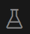
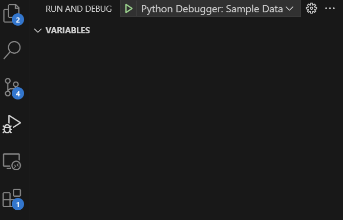
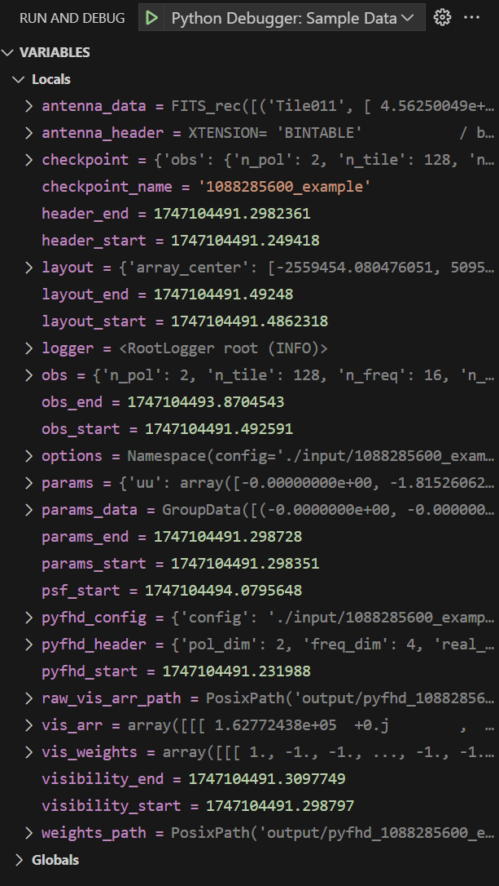

# Contribution Guide

Welcome to your one stop shop for all the tips, tricks, best practices and HOW-TOs on contributing to `PyFHD`. This guide was made in an effort to keep `PyFHD` documented and maintainable encouraging all new and experienced people to follow best practices.

## Developer Installation of PyFHD

If you're a developer of PyFHD, welcome to the club! 

For development purposes using `mamba` or `conda` as your package and environment manager makes changing your Python version when you need to is much easier than using `venv` for such purposes. Alternatively, if you wish to add features to `PyFHD` or eventually decide you have the need for speed and want modules made from other languages in there such as C/C++/Fortran/Julia etc. `mamba`/`conda` make it easier to install compilers or tools (even makes installing CUDA relatively easy).

Here's how you install `PyFHD` for development purposes:

1. Clone and change directory into the `PyFHD` repo:
    ```bash
    git clone https://github.com/ADACS-Australia/PyFHD && cd PyFHD
    ```
2. Create a `pyfhd` virtual environment and automatically install the required dependencies
   ```bash
   conda env create --file environment.yml
   ```
3. Install PyFHD
    ```{important}
    The most important difference between a standard install and a developer install is in this step the `-e` in the command makes the package editable, meaning new runs of `PyFHD` will interact with the changes you make without having to reinstall `PyFHD` via pip for every change.
    ```
    ```bash
    pip install -e .
    ```
    
4. Verify the installation using the version command
    ```
    pyfhd -v
       ________________________________________________________________________
       |    ooooooooo.               oooooooooooo ooooo   ooooo oooooooooo.    |
       |    8888   `Y88.             8888       8 8888    888   888     Y8b    |
       |    888   .d88' oooo    ooo  888          888     888   888      888   |
       |    888ooo88P'   `88.  .8'   888oooo8     888ooooo888   888      888   |
       |    888           `88..8'    888          888     888   888      888   |
       |    888            `888'     888          888     888   888     d88'   |
       |    o888o            .8'     o888o        o888o   o888o o888bood8P'    |
       |                 .o..P'                                                |
       |                `Y8P'                                                  |
       |_______________________________________________________________________|
       
       Python Fast Holographic Deconvolution 

       Translated from IDL to Python as a collaboration between Astronomy Data and Computing Services (ADACS)
       and the Epoch of Reionisation (EoR) Team.

       Repository: https://github.com/ADACS-Australia/PyFHD

       Documentation: https://pyfhd.readthedocs.io/en/latest/

       Version: 1.0

       Git Commit Hash: b77d18d0ef640297264ce700696d75aa4ff5ea82
    ```

## The How-To on contributing to PyFHD

This part of the guide will cover how to contribute to PyFHD, we'll go over some of the thoughts and ideas that one ought to use when creating a new function from scratch for `PyFHD`. We're going to use the examples along the way from `PyFHD` most of it showcasing the best of what `PyFHD` has done in each section. Many of the best practices applied in `PyFHD` are useful for any project you're doing, so if you're new to programming and development in general, I hope you find these docs useful to you.

### Has someone invented the wheel?

The very first question you should ask yourself before making a new function is, do you need to or has someone already created the function?

Take the `histogram` function for example, are you wondering why we did a histogram function? 

After all, `IDL's` histogram function can be done using a combination of `np.histogram` and the reverse indices can technically be done using many indexing functions available in NumPy as well. Well it turns out the NumPy functions like `np.histogram` suffer from a fatal flaw, they're awfully slow with large arrays, and this isn't necessarily their fault either, NumPy (rightly for their particular case) prioritised compatibility over raw speed. Other than speed, a function needed to be made to create the reverse indices part of `IDL's` histogram anyway as there is no `SciPy` or `NumPy` equivalent. As such it was decided to rewrite the histogram from scratch with speed as the priority given that `histogram` in `PyFHD` get's called hundreds, maybe hundreds of times.

To summarise, only make a new function if it hasn't been made before, or the ones that do exist do not meet your requirements. The requirements initally should not include anything in regards to the speed of the function unless you know before hand that the function is going to be called a lot or in a loop. 

If you're wondering what to do in the case that the function is in a library/package that is no longer being supported anymore? It's likely you'll need to remake it at some stage, and depending on the license of the original library/package, you might be able to copy and paste the function into PyFHD (with acknowledgements to the original library/package).

### Making a new function

You've decided PyFHD needs a new function, excellent looking forward to your contribution!

The next question you ought to ask yourself is where to put the new function. `PyFHD` has a directory system where any functions that are used by certain parts of the `PyFHD` pipeline are stored in named directories. For example any function used exclusively for `gridding` ends up in the gridding directory, either as a new file or in the `gridding_utils.py` file. If the function will be used in all areas of `PyFHD` then and **only** then should you put the function inside the `pyfhd_tools/pyfhd_utils.py` file.

If you think it's the start of a new part of the pipeline, then create a new directory, and inside that new directory you must also create an `__init__.py` file. The `__init__.py` file tells Python this is a part of the package and to look there for new modules, the `__init__.py` can be completely empty if you have no use for it. 

From there I'll leave it upto you, time to put that function from your head to a screen.

### Need to add an option to `pyfhd_config`?

`PyFHD` uses `configargparse` to process all the options for a run, the options are parsed in via a `YAML` file. In order to add an option you need to do two things:
1. Add the option to the YAML file with a good default value that is a good value in most cases, and if that isn't the case use the value you use the most
2. Also add the option into `PyFHD/pyfhd_tools/pyfhd_setup.py` via the function `pyfhd_parser`. The `pyfhd_parser` function creates the argparse object. The argparse object contains multiple groups of options, each group usually corresponds to each part of the PyFHD pipeline, please add the option into the most appropriate group, e.g. if you want the option to be inside calibration add the new option to the calibration group. There will be plenty of examples inside the same function for you to refer to when making a new option. Each option must contain:
   * The option argument string you're using, any spaces in your option should be replaced with a dash i.e. `new option` -> `--new-option`
   * A default value, this is set by using `default =`. If you're dealing with a boolean toggle value, set the `default = False`, and configure the `YAML` to have the default value you want it too.
   * If you're doing a boolean value then set an `action` to `'store_true'`, in the case of a list you should use the action `'append'` and put an empty list in the `YAML` file for that option.
   * Help text which explains when and why to use the option, and if it conflicts with tother options describe how they conflict in that help text or define what happens when there are conflicting options using the `pyfhd_setup` function where we check all the options to ensure they are valid. Ideally try to keep all validation checking for those options inside `pyfhd_setup` if you can.

From there you can reference the option created using `pyfhd_config[new_option]`, do take note all dashes in the option name are converted to underscores to avoid conflict with python's `-` operator. Inside the yaml you will also see `~` which represents a python `None` object. An example is provided below added to the `pyfhd_parser`:

```py
plotting.add_argument(
    "--calibration-plots",
    default=False,
    action="store_true",
    help="Turns on the plotting of calibration solutions",
)
```

For adding options I would also avoid adding options that negate something e.g. `--no-calibration-plots`, as these can be confusing to set, as you can start dealing with double negatives. If you wish to have an option that is negatable, then I'd suggest using the `action`, `argparse.BooleanOptionalAction` so when adding a boolean option in the command line it will automatically add the `--no` argument. For example, we could change the above `calibration-plots` to incorporate this action:

```py
import argparse

plotting.add_argument(
    "--calibration-plots",
    default=False,
    action=argparse.BooleanOptionalAction,
    help="Turns on the plotting of calibration solutions",
)
```

This will add the option for `--no-calibration-plots` in the command line without having to define it inside the code or configuration files. 

### Documenting and Typing the new function

You have made your new function, congratulations, now it's time to add some documentation and comments if you haven't already. In PyFHD, we use docstrings in the [`numpydoc`](https://numpydoc.readthedocs.io/en/latest/format.html) which is well documented in terms of what you should put into your docstrings and what each section in the docstring is for. There is specific formatting to follow and deviations from the format will result in weird outputs for read the docs once the docstring is read in for auto generating the API reference so please follow the numpydoc format precisely.

When it comes to comments in PyFHD, there are some functions which are heavily commented and others are not, in general comments should be about the intention and the reason why the code exists, rather than what it does. It's often said good, clean code shouldn't need comments as it's descriptive enough to be followed, which for the most part is somewhat true, however, I personally don't think that's always true, and so having comments about what something does isn't necessarily a bad thing. The rule I like to follow is somewhere in between, some pieces of code do occasionally need you to say what they are doing as good docstrings can also tell people why you have done what you have done. Remember, comments are gifts to yourself when you have to re-read the same function a year later, so if a function has more comments than you need, who cares?

In PyFHD we're also using the Python typing systems and packages. In PyFHD they have been primarily used in the definition of functions, to ensure the not only is the type of each variable visible, but in the case of NumPy typing, you can also show the expected precision. The reason for using the typing system is making the development experience better in IDE's like VSCode or PyCharm, as the IDE will show you the function as you're typing it out. It only takes an extra 2 seconds per parameter on the defintion of a new function but can save you hours of pain. Features inside IDE's such as code completion, code hinting usually come under the umbrella of [Intellisense](https://code.visualstudio.com/docs/editor/intellisense). In the future, it's possible to use tools such as [MyPy](https://mypy.readthedocs.io/en/stable/) to enforce these types too.

For examples of docstrings in PyFHD check out the following doc strings from the `get_ri` and `histogram` functions. 

```python
# Notice how we can specificy we're wanting a numpy array of type int64 or float64, makes it clear to users of this
# function the limits and bounds of what the function can take as input.
def get_ri(data: NDArray[np.floating | np.integer | np.complexfloating], bins: NDArray[np.float64 | np.int64], hist: NDArray[np.int64], min: int | float, max: int | float) -> NDArray[np.int64]:
    """
    Calculates the reverse indices of a data and histogram. 
    The function replicates IDL's REVERSE_INDICES keyword within
    their HISTOGRAM function. The reverse indices array which is returned
    by this function can be hard to understand at first, I will explain it here
    and also link JD Smith's famous article on IDL's HISTOGRAM.

    The reverse indices array is two vectors concatenated together. The first vector contains
    indexes for the second vector, this vector should be the size of bins + 1. 
    The second vector contains indexes from the data itself, and should be the size of data.
    The justification for having such an array is to quickly make adjustments to certain bins
    without having to search the array multiple times, thus avoiding multiple O(data.size) loops.

    The first vector indexes contain the starting positions of each bin in the second vector. For example, 
    between the indexes given by first_vector[0] and first_vector[1] of the second vector should be all the 
    indexes of bins[0] from inside the data. So if I wanted to make adjustments to the entire first bin, 
    and only the first bin I can use the reverse indices array, ri to do this. Let's say I wanted to flag
    all values of bins[0] with -1 for some reason to make them invalid in other calculations with the data, 
    then I could do this:

    `data[ri[ri[0] : ri[1]]] = -1`

    Or more generally

    `data[ri[ri[i] : ri[i + 1]]] = -1`

    Where i is 0 <= i <= bins.size.

    If you wish to gain a better understanding of how this get_ri function works, and the associated
    histogram function I have created here, please use the link given in the Notes section. This
    link will take you JD Smith's article on IDL's HISTOGRAM, it is an article which explains the
    IDL HISTOGRAM function better than IDL's own documentation. If you must gain a deeper understanding,
    read it once, gasp and get your shocks and many cries of why out of your system, then read it again.
    And keep reading it till you understand, as per the editor's note on the article:

    "...If you read it enough, the secrets of the command will be revealed to you. Stranger things have happened"

    Parameters
    ----------
    data : NDArray[np.float\_ | np.int\_ | np.complex\_]
        A NumPy array of the data
    bins : NDArray[np.float64 | np.int64]
        A NumPy array containing the bins for the histogram
    hist : NDArray[np.int64]
        A NumPy array containing the histogram
    min : int | float
        The minimum for the dataset
    max : int | float
        The maximum for the dataset

    Returns
    -------
    ri : NDArray[np.int64]
        An array containing the reverse indices, which is two vectors, the first vector containing indexes for the second vector.
        The second vector contains indexes for the data.

    See Also
    ---------
    histogram: Calculates the bins, histogram and reverse indices.
    get_bins: Calculates the bins only
    get_hist: Calculates histogram only

    Notes
    ------
    'HISTOGRAM: The Breathless Horror and Disgust' : http://www.idlcoyote.com/tips/histogram_tutorial.html
    """

    # Hopefully you noticed a long descriptive docstring, you should also notice the types
    # and returns are in there as well
    pass

# Again notice the typing, and the typing of the return, again makes it clear to people to always expect three return
# variables, and not only that, what type to expect them to be.
def histogram(data : NDArray[np.floating | np.integer | np.complexfloating], bin_size: int = 1, num_bins: int | None = None, min: int | float | None = None, max: int | float | None = None) -> tuple[NDArray[np.int64], NDArray[np.float64 | np.int64], NDArray[np.int64]]:
    """
    The histogram function combines the use of the get_bins, get_hist and get_ri
    functions into one function. For the descriptions and docs of those functions
    look in See Also. This function will return the histogram, bin/bin_edges and
    the reverse indices.

    Parameters
    ----------
    data : NDArray[np.float\_ | np.int\_ | np.complex\_]
        A NumPy array containing the data we want a histogram of
    bin_size : int, optional
        Sets the bin size for this histogram, by default 1
    num_bins : int | None, optional
        Set the number of bins this does override bin_size completely, by default None
    min :  int | float | None, optional
        Set a minimum for the dataset, by default None
    max :  int | float | None, optional
        Set a maximum for the dataset, by default None

    Returns
    -------
    hist : NDArray[np.int64]
        The histogram of the data
    bins : NDArray[np.float64 | np.int64] 
        The bins of the histogram
    ri : NDArray[np.int64]
        The reverse indices array for the histogram and data
    
    See Also
    --------
    get_bins: Calculates the bins only
    get_hist: Calculates histogram only
    get_ri: Calculates the reverse indices only
    """

    # Take note of how multiple returns are defined here, that format is needed exactly for numpydocs and readthedocs
    # to represent multiple returns properly.
    # Also take note of the See Also sections pointing potentially to similar functions, or functions used
    # inside of the histogram function
    pass
```

You should notice the typing system in use with the colon's after each parameter telling you what types the inputs should be. Using extensions for VSCode or PyCharm can allow you to automatically create the skeleton for the docstring such as [autoDocstring](https://marketplace.visualstudio.com/items?itemName=njpwerner.autodocstring) for VSCode. You'll notice as well when using extensions for the auto doc strings that the typing you have hopefully just implemented will be picked up automatically with little to no extra effort needed for formatting. Using the typing system may feel like a waste of time at first, but the more you use typing and the more you use typed functions the more you realise you're no longer thinking about the small details of functions anymore, but focusing on what they do and how/when they're used instead.

Combining docstrings, comments and typing together when used well and best practices followed allows for easier, faster debugging in the future. Furthermore, it's easier to keep track of your changes and how they could affect the rest of the codebase. If that sounds good to you as it does to us, let's keep the faster debugging train going. 

### Testing the new function

In an ideal world, every new function you make has at least 3 tests. In this ideal world the tests cover corner cases as well as expected cases. It has been my experience so far in `PyFHD` that small simulated data seems to work well for testing these functions and usually gives a great indication that `PyFHD` will work with real data. The simulated data also allows you to more easily find those corner cases and ensures testing the function doesn't take hours per test. With testing functions like `histogram` we had the benefit of creating as many tests as we wanted given we were replicating the IDL function, this is the best case scenario. With functions that were translated from `FHD`, in general we'd run the functions in `FHD` and save the input variables and the output variables. The `sav` files would then be read in by a testing function and generally converted to HDF5 for faster and easier reading in the future for the same test. 

For creating a test in `PyFHD` we have utilised the pytest framework which is a powerful testing framework that searches for any function and/or directory that has the word `test` at the start or end of the function name or directory name. A useful feature of pytest are `fixtures` which are heavily used throughout the testing of PyFHD. Fixtures allow you to make functions which perform routines needed for a function, in the case of `test_histogram.py` I used a fixture to spread the data directory across all functions without having to contunally copy and paste the path. When making a test for `PyFHD` the `numpy.testing` package was particularly useful as it contains functions like `np.testing.assert_allclose` which allow you to test the differences between arrays upto an absolute and/or relative precision. See below for a test made for the histogram function which utilises a pytest fixture:

```python
import pytest
import numpy as np
from os import environ as env
from pathlib import Path
from PyFHD.pyfhd_tools.pyfhd_utils import histogram
from PyFHD.pyfhd_tools.test_utils import get_data, get_data_items

@pytest.fixture
def data_dir():
    # This assumes you have used the splitter.py and have done a general format of **/FHD/PyFHD/tests/test_fhd_*/data/<function_name_being_tested>/*.npy
    return Path(env.get('PYFHD_TEST_PATH'), 'histogram')

@pytest.fixture
def full_data_dir():
    return Path(env.get('PYFHD_TEST_PATH'), 'full_size_histogram')

def test_idl_example(data_dir: Path) :
    """
    This test is based on the example from the IDL documentation.
    This ensures we get the same behaviour as an example everybody can see.
    """
    # Setup the test from the histogram data file
    data, expected_hist, expected_indices = get_data(data_dir, 'idl_hist_example.npy', 'idl_example_hist.npy', 'idl_example_inds.npy')
    # Now that we're using numba it doesn't support every type, set it to more standard NumPy or Python types
    data = data.astype(int)
    hist, _, indices = histogram(data)
    assert np.array_equal(hist, expected_hist)
    assert np.array_equal(indices, expected_indices)
```

Pytest fixtures have the ability to group other fixtures too, take `test_cal_auto_ratio_divide` as an example, `test_cal_auto_ratio_divide` was set up with multiple pytest fixtures with multiple parameters. These pytest fixtures in `test_cal_auto_ratio_divide` automatically generate groups of tests without duplicating code for each test. You should also notice the use of the `numpy.testing` library as well. The below code generates 6 tests using the fixtures `tag` and `run` primarily. This test also shows how you can skip certain groups if you need to. Please take note as the comments go into more detail and I've added doc strings that aren't present in the tests to be more descriptive.

```python
from PyFHD.io.pyfhd_io import recarray_to_dict
import pytest
from os import environ as env
from pathlib import Path
from PyFHD.calibration.calibration_utils import cal_auto_ratio_divide
from PyFHD.use_idl_fhd.use_idl_outputs import convert_sav_to_dict
from PyFHD.pyfhd_tools.test_utils import sav_file_vis_arr_swap_axes
from PyFHD.io.pyfhd_io import save, load
import numpy.testing as npt

# Here we set up a fixture for the main data directory where all the files required for testing are
# I set up the testing framework to utlise an environment variable PYFHD_TEST_PATH so where ever you store the 
# files from the FHD runs, adjust it to that path.
@pytest.fixture()
def data_dir():
    return Path(env.get('PYFHD_TEST_PATH'), "cal_auto_ratio_divide")

# With the FHD runs we used test tags, so all the files had consistent naming formats, 
# for example, one of the test files was point_zenith_run1_before_cal_auto_ratio_divide.sav
# In that file, we used the tags point_zenith, run1 and before to indicate to the developer
# and to the tests, which test the files were for and if the files were used for input ("before")
# or were used for validation ("after"). In this case we're using a fixture to set 3 different parameters.
@pytest.fixture(scope="function", params=['point_zenith','point_offzenith', '1088716296'])
def tag(request):
    return request.param

# We're using another fixture to set the run identifiers.
@pytest.fixture(scope="function", params=['run1', 'run3'])
def run(request):
    return request.param

# Using pairs of tag and run identifiers, we can skip certain tests in the case of the file not existing
# or for some other reason, why this is needed will become clear soon.
skip_tests = [['1088716296', "run3"]]

# For each combination of tag and run, check if the hdf5 file exists, if not, create it and either way return the path
# Tests will fail if the fixture fails, not too worried about exceptions here. The fixtures are re-executed for each test run.
# The purpose of the best_file fixture is take each combination of the fixtures in the format f"{tag}_{run}_before_{data_dir.name}"
# and create the required file.
@pytest.fixture()
def before_file(tag, run, data_dir):
    """
    Creates the before HDF5 from the sav files from FHD

    Parameters
    ----------
    tag: str
        The tag/name of the FHD run we're grabbing data from, these are often named from their observation
        ID or from special ones that have been made like point_zenith (an observation at the zenith).
    run: str
        The identifier for the run, in FHD we often ran 3 (or more) different sets of parameters for each observation
        we used to generate tests from FHD to ensure we covered the different functions in FHD.
    data_dir: Path
        The path to the directory containing the files required for each test 
    """
    # Note the check for skip tests right at the start
    if ([tag, run] in skip_tests):
        return None
    before_file = Path(data_dir, f"{tag}_{run}_before_{data_dir.name}.h5")
    # If the h5 file already exists and has been created, return the path to it
    # This is done because the fixtures are re-executed for each test.
    if before_file.exists():
        return before_file
    
    sav_file = before_file.with_suffix('.sav')
    sav_dict = convert_sav_to_dict(str(sav_file), "faked")

    obs = recarray_to_dict(sav_dict['obs'])
    cal = recarray_to_dict(sav_dict['cal'])
    vis_auto = sav_file_vis_arr_swap_axes(sav_dict['vis_auto'])
        
    #super dictionary to save everything in
    h5_save_dict = {}
    h5_save_dict['obs'] = obs
    h5_save_dict['cal'] = cal
    h5_save_dict['cal']['gain'] = sav_file_vis_arr_swap_axes(h5_save_dict['cal']['gain'])
    h5_save_dict['vis_auto'] = vis_auto
    h5_save_dict['auto_tile_i'] = sav_dict['auto_tile_i']

    # This function was made specifically for PyFHD but you could probably use it elsewhere
    save(before_file, h5_save_dict, "before_file")

    # This seems like it does one return but with the power of fixtures each time we run a test it will get fed
    # with the tag, run and data_dir to check the required file exists.
    return before_file

# Same as the before_file fixture, except we're taking the the after files
@pytest.fixture()
def after_file(tag, run, data_dir):
    if ([tag, run] in skip_tests):
        return None
    after_file = Path(data_dir, f"{tag}_{run}_after_{data_dir.name}.h5")
    # If the h5 file already exists and has been created, return the path to it
    if after_file.exists():
        return after_file
    
    sav_file = after_file.with_suffix('.sav')
    sav_dict = convert_sav_to_dict(str(sav_file), "faked")

    #super dictionary to save everything in
    h5_save_dict = {}

    h5_save_dict['cal'] = recarray_to_dict(sav_dict['cal'])
    h5_save_dict['cal']['gain'] = sav_file_vis_arr_swap_axes(h5_save_dict['cal']['gain'])
    h5_save_dict['auto_ratio'] = sav_file_vis_arr_swap_axes(sav_dict['auto_ratio'])

    save(after_file, h5_save_dict, "after_file")

    return after_file

def test_cal_auto_ratio_divide(before_file, after_file):
    """
    Runs all the given tests on `cal_auto_ratio_divide` reads in the data in before_file and after_file,
    and then calls `cal_auto_ratio_divide`, checking the outputs match expectations

    Focusing on the before_file for a second, by using before_file as a parameter here it uses runs the 
    before_file function which itself takes in the tag, run and data_dir fixtures which create the following combination
    of tests and before files:
    ['point_zenith', 'run1', Path(env.get('PYFHD_TEST_PATH'), "cal_auto_ratio_divide")] this outputs the point_zenith_run1_before_cal_auto_ratio_divide.h5
    ['point_offzenith', 'run1', Path(env.get('PYFHD_TEST_PATH'), "cal_auto_ratio_divide")] this outputs the point_offzenith_run1_before_cal_auto_ratio_divide.h5
    ['1088716296', 'run1', Path(env.get('PYFHD_TEST_PATH'), "cal_auto_ratio_divide")]] this outputs the 1088716296_run1_before_cal_auto_ratio_divide.h5
    ['point_zenith', 'run3', Path(env.get('PYFHD_TEST_PATH'), "cal_auto_ratio_divide")] this outputs the point_zenith_run3_before_cal_auto_ratio_divide.h5
    ['point_offzenith', 'run3', Path(env.get('PYFHD_TEST_PATH'), "cal_auto_ratio_divide")] this outputs the point_offzenith_run3_before_cal_auto_ratio_divide.h5
    ['1088716296', 'run3', Path(env.get('PYFHD_TEST_PATH'), "cal_auto_ratio_divide")]] this outputs the 1088716296_run3_before_cal_auto_ratio_divide.h5

    Which effectively means we create 6 files, and using the fixtures we have created a way to create 6 tests with 6 functions, rather than having to duplicate
    our code to read in and write the files for every single test we want to run.
    """
    # Take a note here that if the before_file or after_file returned None we tell pytest to skip the test, so if you see skips
    # its not a bad thing!
    if (before_file == None or after_file == None):
        pytest.skip(f"This test has been skipped because the test was listed in the skipped tests due to FHD not outputting them: {skip_tests}")

    h5_before = load(before_file)
    h5_after = load(after_file)

    obs = h5_before['obs']
    cal = h5_before['cal']
    vis_auto = h5_before['vis_auto']
    auto_tile_i = h5_before['auto_tile_i']

    expected_cal = h5_after['cal']
    expected_auto_ratio = h5_after['auto_ratio']

    result_cal, result_auto_ratio = cal_auto_ratio_divide(obs, cal, vis_auto, auto_tile_i)

    # The only downside to doing things this way is that in order to have different atol or rtol
    # for different tests or need to do something specific you'll need to do if statements to check for that test e.g.
    # if "point_zenith" in before_file:
    #    do something unique
    atol = 8e-6
    npt.assert_allclose(expected_auto_ratio, result_auto_ratio, atol=atol)

    #check the gains have been updated
    npt.assert_allclose(expected_cal['gain'], result_cal['gain'], atol=atol)
```

Once you have set up the tests, every time you change the code and re-run the test you can be sure you haven't broken existing functionality accidentally giving you more confidence that the changes you have made will improve `PyFHD`. This section wasn't necessarily about teaching you the specifics on how to test, but to show why we do it. It's testing that has enabled us to be sure that `PyFHD` actually does the same things as `FHD` and even in some cases detect bugs on the `FHD` side. If you want to learn more about testing check out the numpy testing functions [here](https://numpy.org/doc/stable/reference/routines.testing.html) and also check out pytest [here](https://docs.pytest.org/en/7.4.x/).

### Debugging

Tools that will help you during testing are the debugging tools available in IDE's like those in VSCode and PyCharm. Debugging tools allow you to get away from using print statements to using breakpoints instead, allowing you to see the entire snapshot of your function at that point in time in the code. This does make it easier to track down issues, see portions of large arrays, watch certain variables throughout the code to see how they change etc. VSCode in particular can allow you to set log points which can act like print statements without you having to put anything into the code. Breakpoints (and log points!) can also have conditions attached to them, so if you know you're looping through frequencies and you know an issue happens with frequency index 13, you can make a breakpoint condition that will trigger only when the frequency index is 13. To learn more about conditional breakpoints go [here](https://code.visualstudio.com/docs/debugtest/debugging#_conditional-breakpoints).

For doing debugging on tests specifically while in VSCode, it's usually easiest to setup the Testing part of the VSCode IDE that is bundled in with the Python extension, I'll leave a guide here to set it up:

1. First download the [Python extension](https://marketplace.visualstudio.com/items/?itemName=ms-python.python) from the VSCode marketplace (this should also download the Python Debugger).
2. Navigate to the testing tab in VSCode on the left sidebar, it should look like a beaker

{align=center}

3. In that testing tab it should offer you some text or a button you can click to setup the tests. Alternatively you can bring up the command palette <kbd>Ctrl + Shift + P</kbd> on Windows/Linux or <kbd>Shift + Command + P</kbd> for Mac and search for **Python: Configure Tests**.

4. When going through the process it should:
    1. Ask if you're using pytests or unittest, choose **pytest**
    2. For the directory, choose the root directory of the repository.
    3. From there it should automatically discover the tests in the repository

5. Hover over one of the tests and you should see three buttons:

    {align=center}

    Each of these buttons does the following things in order: Runs the test, Runs the test with Debugging enabled, Runs the test with coverage enabled.
    In this case, click the second test with the bug on it.
    From there the test should run with debugging enabled and stop at breakpoints set in the tests themselves or the code the test touches.

It's also possible to setup a debug sesion for running ``PyFHD`` in the command line, this is setup using the ``launch.json`` file in the VSCode Workspace inside the ``.vscode`` directory. An example with comments that contain more detail is below, this is based on running the sample data as per the tutorial:

```json
{
    // Use IntelliSense to learn about possible attributes.
    // Hover to view descriptions of existing attributes.
    // For more information, visit: https://go.microsoft.com/fwlink/?linkid=830387
    "version": "0.2.0",
    "configurations": [
        {
            // You can name it whatever you want.
            "name": "Python Debugger: Sample Data",
            // This needs to be set to debugpy
            "type": "debugpy",
            // There's multiple ways to do this, you could also attach
            // to a python process
            "request": "launch",
            // Tells debugpy to run the main pyfhd.py file.
            "program": "PyFHD/pyfhd.py",
            "console": "integratedTerminal",
            // Set the arguments, if you want multiple configurations
            // I'd suggest duplicating the configuration, and change the name
            // and args to get multiple debugging profiles.
            "args": [
                "-c", 
                "./input/1088285600_example/1088285600_example.yaml",
                // Here's an example of using the command line to override or negate the yaml file
                "--no-silent",
                "108885600"
            ],
            // If you select the Python Interpreter in VSCode this isn't needed.
            "python": "/path/to/python/env/python"
            // Set to false if you need to debug interactions with PyFHD and it's dependencies
            "justMyCode": true,
            // If you're inside a docker or singularity container, you likely need to also set the
            // path mappings (this tells debugpy where to map your files on your machine to inside
            // the container)
            // "pathMappings": [
            //     {
            //         "localRoot": "${workspaceFolder}",
            //         "remoteRoot": "/pyfhd"
            //     }
            // ]
        }
    ]
}
```

Once you have added that to the ``launch.json`` file go to the Play button with a bug on the left sidebar, and at the top of the sidebar you should no see a dropdown with the name you set:
{align=center}

Click the Play button by the dropdown to run the debug session. Below is an example what it it looks like when you have set a breakpoint and debugging has stopped at that breakpoint:
{align=center}

What has been particuarly useful is the ability at this breakpoint to go deeper into the arrays and see their values, that way you can keep an eye on certain values as they go through parts of the `PyFHD` pipeline. There's also a **Watch** feature, right clicking on a variable can allow you to add it to the watch list, so instead of finding the variable each time you can just check the watch list. 

There are lots of other debugging features that I haven't gove over or explored, if you're interested check out the documentation for the debugging tools in VSCode [here](https://code.visualstudio.com/docs/python/debugging) and the tools for PyCharm [here](https://www.jetbrains.com/help/pycharm/debugging-code.html).

### The Need for Speed

If you're function is running a little slower than you'd like explore the [Numba](https://numba.readthedocs.io/en/stable/index.html) library. Numba is a **J**ust-**i**n-**T**ime (JIT) compiler that compiles your Python code at run time into machine code, it can make your code sveral magintudes faster than it is with little adjustments to the code. One of the nice things about Numba is that you can get away from using vectorization in NumPy and just do things in loops that require less thinking. However, Numba has a particular way of doing things and is harder to debug as the error messages are harder to decipher. Numba does also support CUDA, so if you want to write things for a GPU you can, however it's a slightly different paradigm when it comes to programming for GPUs vs CPUs so be aware your code will change significantly and will likely require you to have a CPU and GPU version of your function. If you are wanting to adopt GPUs consider using [CuPY](https://docs.cupy.dev/en/stable/user_guide/index.html) which can allow you to use GPUs by changing calls of NumPy via `np` to using CuPy using `cp`, it is also possible to create [CPU/GPU agnostic code](https://docs.cupy.dev/en/stable/user_guide/basic.html#how-to-write-cpu-gpu-agnostic-code) with CuPy. Another library that can support CPU/GPU agnostic code is [Dask](https://docs.dask.org/en/stable/10-minutes-to-dask.html) which is a library made for parallel computing with interpoability with NumPy and Pandas, however it does have less support for a lot of the mathematical functions and linear algebra done in `PyFHD`. 

Given that we're using Python, you can of course create a module in C/C++/Fortran/Julia/Rust and use that within `PyFHD`. I have purposely for now not done anything in other languages to avoid having to compile either during installation or publication, I'll leave that upto the EoR community to decide.

### Formatting

PyFHD has adopted the black code formatter, and will run this as a check in the CI before on any PR or push to main. `black` is included in the dependencies for PyFHD, using black can be done in a variety of ways. The simplest one to setup and do is after creating your function inside the PyFHD run the following command:

```
black --check --diff .
```

This will run black over the entire repository and check if you code meets the black formatting standard. In the case that black finds a file that would be reformatted if you ran black it will show the differences that black would do in the same way git shows you differences, and give you this message at the end:

```
Oh no! 💥 💔 💥
x file(s) would be reformatted, xx files would be left unchanged.
```

This is the same check that's done the in Github Actions. To fix this, simply run:

```
black .
```

And it will reformat the files following the black code styling standard. If you run the black command and get the following:

```
All done! ✨ 🍰 ✨
xx files left unchanged.
```

Congrats on doing great styling throughout your new function. Alternatively, it might also mean you got your IDE like VSCode or PyCharm to automatically format any Python files on save using the black code formatter. For formatting in VSCode, check out the page here: [VSCode Python Formatting](https://code.visualstudio.com/docs/python/formatting) and follow the steps for setting a default formatter, making sure to set black as the formatter, you'll also need the extension which can be found here: [Black Extension](https://marketplace.visualstudio.com/items?itemName=ms-python.black-formatter). For doing automatic formatting in Pycharm you can check out this page: [PyCharm Formatting](https://www.jetbrains.com/help/pycharm/reformat-and-rearrange-code.html), there's a section called **Reformat Python code with Black**, follow the instructions there and also check out the rest as they also provide you the ability to format before commits as well.

On that topic, if you do things in command line, `pre-commit` has also been setup in PyFHD with a black configuration done as a pre-commit, once you installed everything you can do:

```
pre-commit install
```

If you want to manually run the pre-commit, which runs black, you can do:

```
pre-commit run --all
```

### Adding your new function to the Changelog

Once you have created your new function, add information about your new function in the new features, giving reasons and to why and when you'd want to use it. You should also notice in the changelog that there is sections for bug fixes, test changes, dependency changes, version changes and translation changes. The bug fixes section should be updated in case you have fixed issues found in the code. The test changes section should be updated in the case you have added, modified or deleted any of the tests, please indicate how they have changed and why. If tests now break because of your changes, ideally fix them before getting to this point by either changing them with comments in the tests as to why they changed, and updating the changelog accordingly. Dependency changes are there to indicate any changes made to the dependencies needed for `PyFHD`, changes mentioned here should be added to the `requirements.txt` and `environment.yml` files. Translation changes refer to any translation efforts from `FHD` to `PyFHD`, or more generally IDL to Python, mention what was translated and why. If there are parts of the `FHD` code you didn't translate mention why in the changelog so someone who does want to tackle it in the future can understand any potential challenges before they begin.

### Pull Request for your new function

Initiate the pull request back to whatever branch the function needs to go in, and during the pull request you should notice a Pull Request Template that pops up with checkboxes, please follow the pull request template and do what it asks of you, one of which you're doing now by reading this contribution guide (Thanks 🙌). The pull request template is there for you to make sure you have followed best practices and for the reviewers to check you have followed best practices as well. 

**If you're not doing any translation from IDL (`FHD`) to Python (`PyFHD`) you can safely stop here, and embark on your many scientific endeavours with PyFHD.**

**Oh you want to do translation?**

**Come this way traveller &rarr; [IDL to Python Translation Guide](idl_translation.md)**