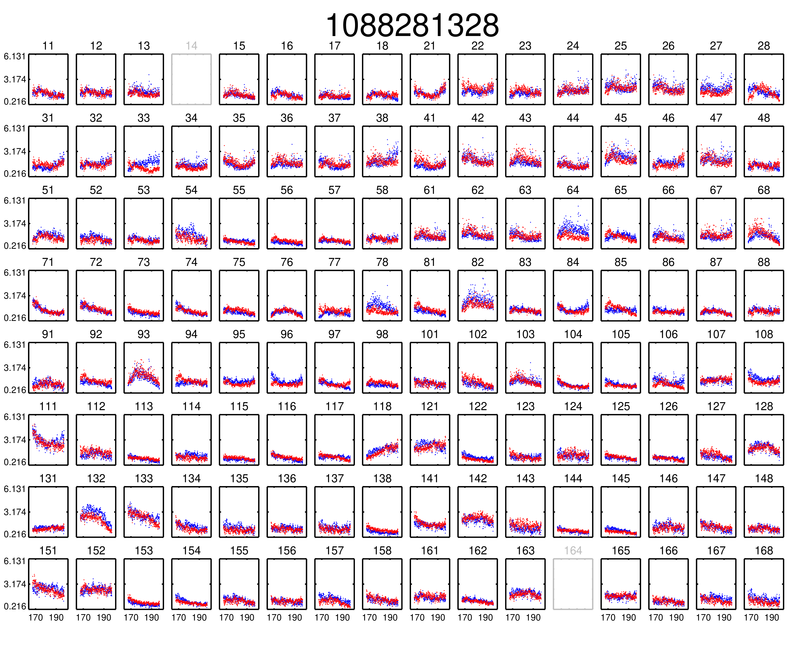
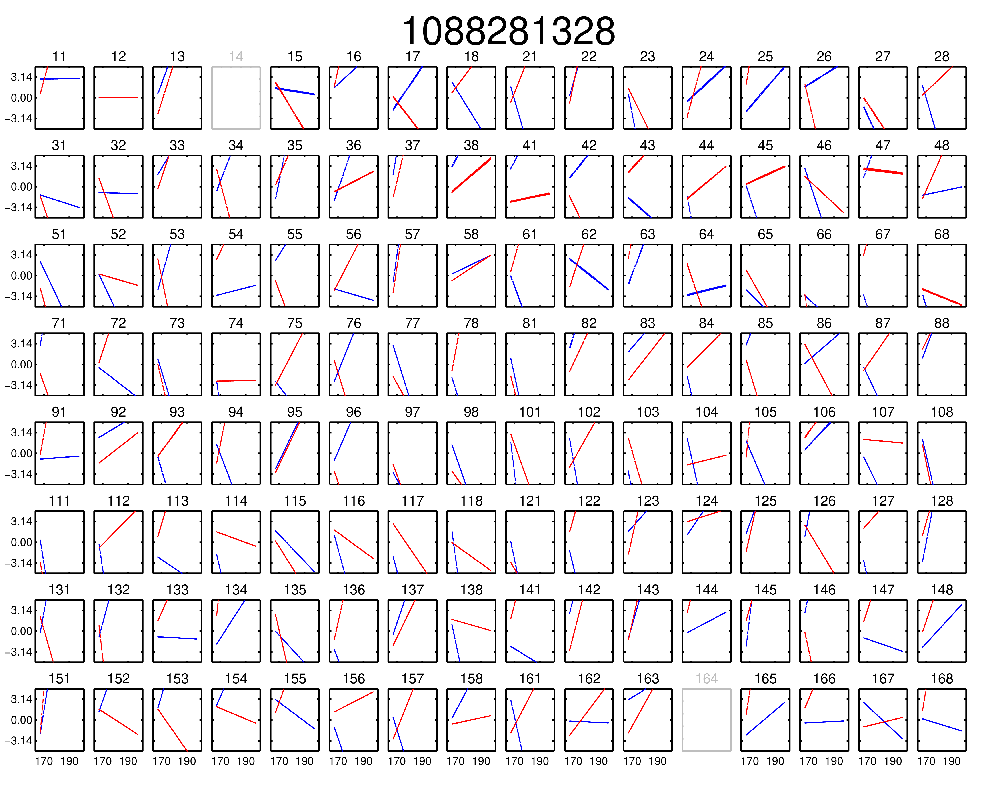
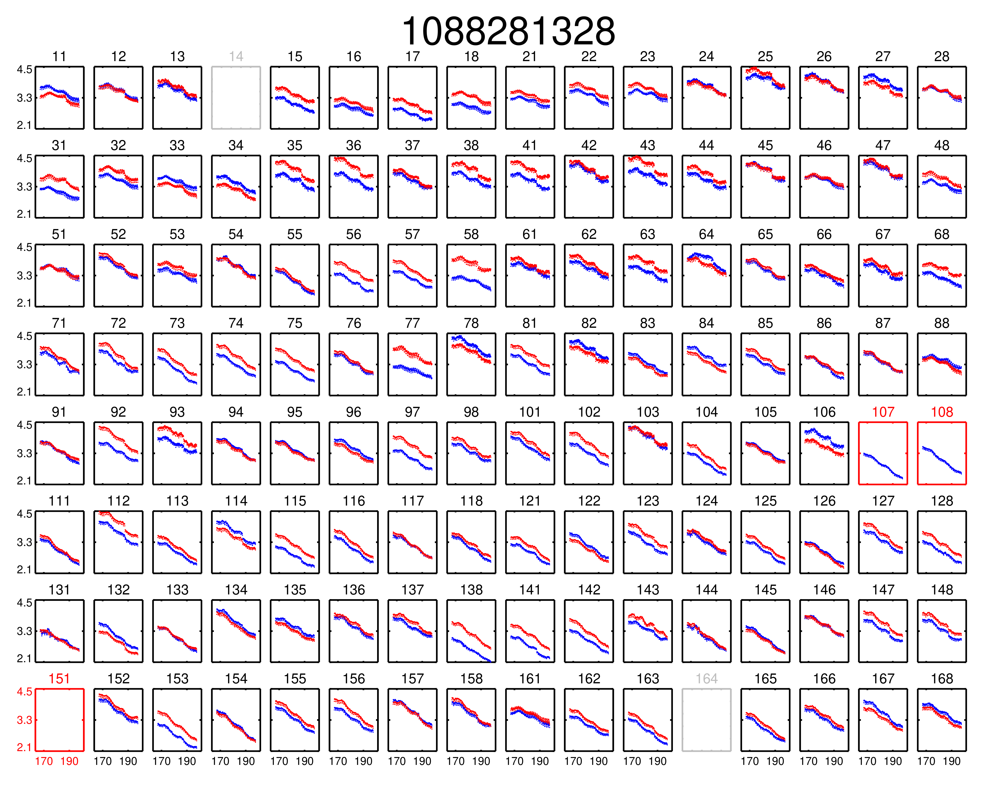
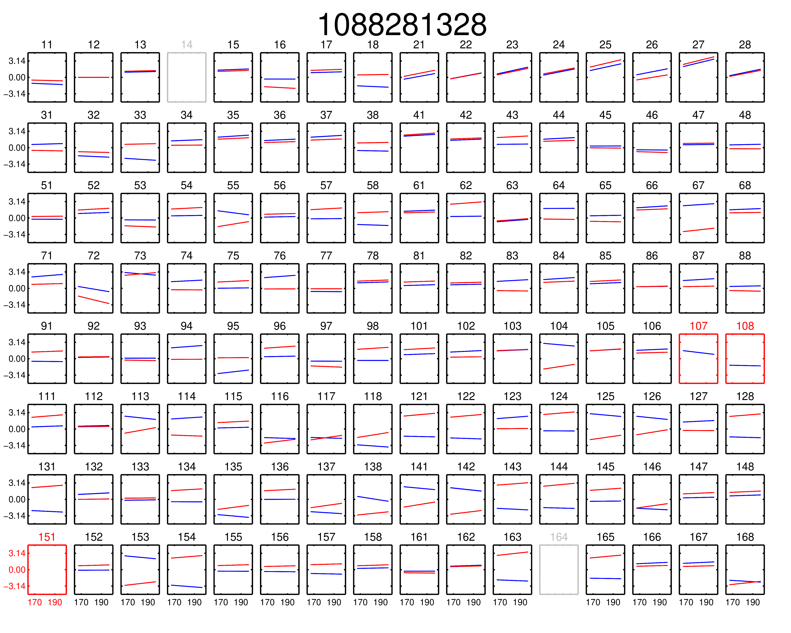

Examples
===========

Preamble - directory structure and using ``FHD`` outputs
----------------------------------------------------------

``FHD`` creates a specific directory structure and naming convention that must be respected for us to use the ``IDL`` outputs. In each of the examples below, if ``FHD`` outputs are required, their expected locations and names will be explained.

Those familiar with ``FHD`` should understand the keyword ``version``; this means ``FHD`` outputs will be output to a subdir called ``fhd`` + ``_`` + version. The equivalent in ``PyFHD`` is the ``--description`` option, which will make a subdir called ``pyfhd`` + ``_`` + description.

When running calibration, ``PyFHD`` will (currently) call ``FHD``, and output everything into a subsubdir, which will start with ``fhd``, so we know the outputs have come from the ``IDL`` code. The following (incomplete) command:

.. code-block:: bash

    pyfhd 1088282552 \
        --output-path /where/be/outputs/ \
        --description my_first_run

will result in a directory structure like this:

.. code-block:: bash

    /where/be/outputs/
    └── pyfhd_my_first_run
      ├── fhd_pyfhd_my_first_run
      │ ├── 1088282552_variables.sav
      │ ├── Healpix
      │ ├── metadata
      │ └── vis_data
      └── gridding_outputs

The ``Healpix``, ``metadata``, and ``vis_data`` subdirs are generated (amongst other things) by ``FHD``. ``fhd_pyfhd_my_first_run`` and ``gridding_outputs`` are created by ``PyFHD``. If you don't want to use ``PyFHD`` as a wrapper to run calibration, but still want to run gridding on ``FHD`` outputs, either run ``FHD`` to create/output into ``fhd_pyfhd_my_first_run``, or just symlink in the ``Healpix``, ``metadata``, and ``vis_data``. Otherwise ``PyFHD`` won't be able to find the ``FHD`` outputs.

.. warning::
    
    If you don't use ``PyFHD`` to run ``FHD``, the ``1088282552_variables.sav`` file won't be saved. ``PyFHD`` needs some extra information that isn't saved by default in ``FHD``. Adding the line 

    .. code-block:: idl

        save, bi_use, weights_flag, variance_flag, model_return, preserve_visibilities, filename=file_path_fhd + '_variables.sav'

    into your ``FHD`` run should produce the needed file (this is what ``PyFHD`` does internally).

Once ``PyFHD`` is fully Pythonic, this file structure faffing about will be handled internally to the code. Please bear with us for now.

Running basic calibration (uses IDL)
-------------------------------------------

.. todo::
   
   Replace this example with an observation that is easy to calibrate, and ensure it's publicly available data. Perhaps include instructions on how to download the data as well so ANYONE can run this command. Then, we can make this basic calibration the first part of the advanced calibration, showing how two levels of calibration is sometimes needed.


Full Pythonic calibration has not been implemented yet. In the interim, you can run limited calibration through ``PyFHD`` by using it as a wrapper to call ``FHD``. An extremely basic example is shown here:

.. code-block:: bash

    pyfhd \
        1088281328 \
        --input-path=/path/to/data/ \
        --output-path=/place/for/outputs/ \
        --description=cal_real_data \
        --calibration-catalog-file-path=/path/to/sky_model/GLEAM_v2_plus_rlb2019.sav \
        --conserve-memory --memory-threshold=1000000000 \
        --IDL_calibrate

.. note:: This command took 235 minutes using 1 core of a Intel Gold 6140 processor and < 15GB RAM on the OzStar cluster

For this command to work, the following two inputs must exist:

.. code-block:: bash

  /path/to/data/1088281328.uvfits # the input visibility data
  /path/to/data/1088281328.metafits # the input metafits file

These paths are inferred from the observation number (1088281328) and ``--input-path`` argument. By including the ``--IDL_calibrate`` option, ``PyFHD`` will simply write out a ```.pro`` file (a format that can be fed directly into ``FHD``). ``PyFHD`` will fall back and use any default values as described by ``pyfhd --help``. Beyond those, we set the following arguments explicitly:

.. list-table::
   :widths: 25 25
   :header-rows: 1

   * - Argument
     - Meaning
   * - -\-calibration-catalog-file-path
     - Explicitly point to the sky model catalogue that we want to use
   * - -\-conserve-memory
     - Tells FHD that we want to limit large arrays to conserve memory
   * - -\-memory-threshold
     - Sets the memory threshold to 1GB


Using the ``--output-path`` and ``--description`` arguments sets the topmost output directory to ``/place/for/outputs/pyfhd_cal_real_data``. Upon successful running of this command, the output directory structure should look like this:

.. code-block:: bash

    /place/for/outputs/
    └── pyfhd_cal_real_data
      ├── fhd_calibration_only.pro        # used to run FHD
      ├── general_calibration_only.pro    # used to run FHD
      ├── pyfhd_config.pro                # used to run FHD
      ├── run_fhd_calibration_only.pro    # topmost file used to run FHD
      ├── pyfhd_cal_real_data_17_00_37_29_11_2022.log   # log with date and time of run
      ├── pyfhd_cal_real_data_17_00_37_29_11_2022.yaml  # yaml containing the defaults used in PyFHD
      └── fhd_pyfhd_cal_real_data         # location for FHD outputs
        ├── 1088281328_variables.sav      # extra set of variables saved by PyFHD so python gridding can be run on these FHD outputs
        ├── beams                         # FHD outputs
        ├── calibration                   # FHD outputs
        ├── Healpix                       # FHD outputs
        ├── metadata                      # FHD outputs
        ├── output_data                   # FHD outputs
        ├── output_images                 # FHD outputs
        └── vis_data                      # FHD outputs

If you look in the ``/place/for/outputs/pyfhd_cal_real_data/fhd_pyfhd_cal_real_data/output_images`` you will find plots including the calibration amplitude and phases:





We have solutions! Turns out this is a difficult observation to calibrate and so using these default settings only does an OK job. Check out the next example on running a more advanced calibration.


Running advanced calibration (uses IDL)
-------------------------------------------
.. note:: This mode of running is intended for power users of ``FHD`` who already know what they want to run, but want to take advantage of ``PyFHD`` already.

If you have a set of ``FHD`` ``IDL`` keywords to control calibration, you can simply add them into a text file (as they would appear in ``IDL``) and supply that text file as the argument to ``--IDL_keywords_file``. ``PyFHD`` will then copy these lines and add them into the ``.pro`` templates used to run ``FHD``.

An example command looks like:

.. code-block:: bash

  time pyfhd \
    '1088281328' \
    --input_path=/fred/oz048/MWA/data/2014/van_vleck_corrected/coarse_corr_no_ao/ \
    --output_path=/fred/oz048/jline/ADACS/test_PyFHD/calibrate_real_data/ \
    --description=cal_real_data_advanced \
    --conserve_memory --memory_threshold=1000000000 \
    --IDL_calibrate \
    --IDL_variables_file fhd_variables.pro

where ``fhd_variables.pro`` looks like:

.. code-block:: idl

    pointing='-2'
    calibrate_visibilities=1
    return_cal_visibilities=1
    ;save_uvf=1
    noao_coarse=1
    model_visibilities=1
    model_transfer='/fred/oz048/MWA/CODE/FHD/fhd_nb_data_gd_woden_calstop/woden_models/combined/'
    conserve_memory=1e9
    recalculate_all=1
    mapfn_recalculate=0
    beam_nfreq_avg=1
    ps_kspan=200.
    transfer_psf='/fred/oz048/MWA/CODE/FHD/fhd_nb_data_pointing_beam/beams/gauss_beam_pointing'+pointing+'.sav'
    transfer_weights='/fred/oz048/MWA/CODE/FHD/fhd_nb_data_gd_woden_redo_redo/vis_data/'+obs_id+'_flags.sav'
    export_images=1
    force_data=1
    grid_recalculate=0
    transfer_calibration='/fred/oz048/MWA/CODE/FHD/fhd_nb_data_gd_woden_calstop/cal_transfer/'+obs_id+'_cal.sav'
    restrict_hpx_inds='EoR0_high_healpix_inds_3x.idlsave'
    interpolate_kernel=1
    psf_dim=30
    ;54 on 1e6 mask with -2, 62 on 1e7 with -2
    beam_gaussian_decomp=1
    psf_image_resolution=10.
    psf_resolution=50.
    ;54*250=13500 pixel side and 300sec fit, 54*50=2700 pixel side and 280sec fit
    beam_mask_threshold=1e6
    save_beam_metadata_only=1
    beam_clip_floor=0

This advanced calibration is transferring an initial set of calibration solutions (using ``transfer_calibration``) and running calibration again using an existing sky model (using ``model_transfer``). Amongst other things, it's also using a different primary beam model via the keyword ``transfer_psf``, and a different set of flags via ``transfer_weights``. This calibration results in tighter amplitude and flatter phase solutions:





Gridding IDL calibration outputs
-------------------------------------------

.. note::

   When performing gridding, the gridding kernel object is often large and complex. As such, reading and converting from the native ``IDL`` ``.sav`` binary format should only be done once, and saved into a numpy ``.npz``. An example ``python`` code snippet to do exactly this is:

   .. code-block:: python

      from scipy.io import readsav
      import numpy as np
      sav_dict = readsav('gauss_beam_pointing-2.sav', python_dict=True)
      np.savez('gauss_beam_pointing-2.npz', **sav_dict)

   Be aware this can take hours.

.. todo::
  Work out a way to share the converted ``.sav`` kernels
   

In this example, calibration should already have been run using ``FHD``. We will then take the calibrated visibilities/model and grid them into two groups: even and odd time steps. This is the first step towards creating a power spectrum (:math:`\varepsilon`\ *ppsilon* uses the difference between the even and odd to estimate the noise).

.. code-block:: bash

   pyfhd \
       '1088281328' \
       --input-path /path/to/data/ \
       --output-path /current/working/directory/ \
       --description my_first_run \
       --grid-psf-file /path/to/beams/gauss_beam_pointing-2.npz \
       --ps-kspan=200 \
       --grid_IDL_outputs

For this command to work, the raw data (which ``FHD`` needs to work out some metadata-type things) should exist as specified above as::

    /path/to/data/1088281328.uvfits

The following ``FHD`` outputs must also exist, in these locations:

.. code-block:: bash

    /current/working/directory
    └── pyfhd_my_first_run
      └── fhd_pyfhd_my_first_run
        ├── 1088281328_variables.sav
        ├── metadata
        | ├── 1088281328_obs.sav
        | └── 1088281328_params.sav
        └── vis_data
          ├── 1088281328_vis_XX.sav
          ├── 1088281328_vis_YY.sav
          ├── 1088281328_vis_model_XX.sav
          ├── 1088281328_vis_model_YY.sav
          └── 1088281328_flags.sav 

Other than specifying file paths, the other necessary arguments have the following effect:

.. list-table::
   :widths: 25 25
   :header-rows: 1

   * - Argument
     - Meaning
   * - -\-grid-psf-file
     - A converted ``FHD`` ``psf`` object to use as a gridding kernel
   * - -\-ps-kspan=200
     - Set the width of the gridded visibilities (wavelengths)
   * - -\-grid_IDL_outputs
     - Switches on gridding using ``FHD`` outputs

Once run, this will produce the following outputs:

.. code-block:: bash

   /current/working/directory
   └── pyfhd_my_first_run
     └── gridding_outputs
         ├── 1088281328_gridded_uv_cube_even_XX.h5
         ├── 1088281328_gridded_uv_cube_even_YY.h5
         ├── 1088281328_gridded_uv_cube_odd_XX.h5
         └── 1088281328_gridded_uv_cube_odd_YY.h5

These files contain the gridded data sets, with each frequency slice being a separate ``hdf5`` data object within the relevant file.

Image gridded outputs and project to Healpix (uses IDL)
----------------------------------------------------------
Assuming we have run ``PyFHD`` to grid some visibilities (as detailed in `Gridding IDL calibration outputs`_ above), in this example we will use ``FHD`` to image and project them to Healpix. These outputs can then be input into :math:`\varepsilon`\ *ppsilon*. The example command is:

.. code-block:: bash

   pyfhd \
       '1088281328' \
       --input-path /path/to/data/ \
       --output-path /current/working/directory/ \
       --description my_first_run \
       --grid-psf-file /path/to/beams/gauss_beams_pointing-2.sav \
       --ps-kspan=200 \
       --IDL_healpix_gridded_outputs

Note that unlike in the `Gridding IDL calibration outputs`_ example, this time we point ``--grid-psf-file`` towards an ``IDL`` save file. This is because ``FHD`` needs to access the ``psf`` object within, and ``IDL`` cannot read the ``numpy`` format. This command will write a number of ``.pro`` files to launch ``FHD``, with a small amount of extra code to read in the gridded ``hdf5`` files. For those interested, the template is in ``PyFHD/PyFHD/templates/vis_model_freq_split_read_python.pro``.

Once this code is run, the following outputs are created:

.. code-block:: bash

   /current/working/directory
   └── fhd_pyfhd_my_first_run
     └── Healpix
         ├── 1088281328_even_cubeXX.sav
         ├── 1088281328_even_cubeYY.sav
         ├── 1088281328_odd_cubeXX.sav
         └── 1088281328_odd_cubeYY.sav

Both grid and image/project to Healpix
----------------------------------------
It is straight forward to run the gridding and imaging/healpix projection (detailed in examples `Gridding IDL calibration outputs`_ and `Image gridded outputs and project to Healpix (uses IDL)`_ above) in a single command:

.. code-block:: bash

   pyfhd \
       '1088281328' \
       --input-path /path/to/data/ \
       --output-path /current/working/directory/ \
       --description my_first_run \
       --grid-psf-file /path/to/beams/gauss_beam_pointing-2.npz \
                       /path/to/beams/gauss_beams_pointing-2.sav \
       --ps-kspan=200 \
       --grid_IDL_outputs \
       --IDL_healpix_gridded_outputs

The important thing to note is that we supply both the ``.npz`` and ``.sav`` format beams to the ``--grid-psf-file``, which keeps both ``Python`` and ``IDL`` happy.