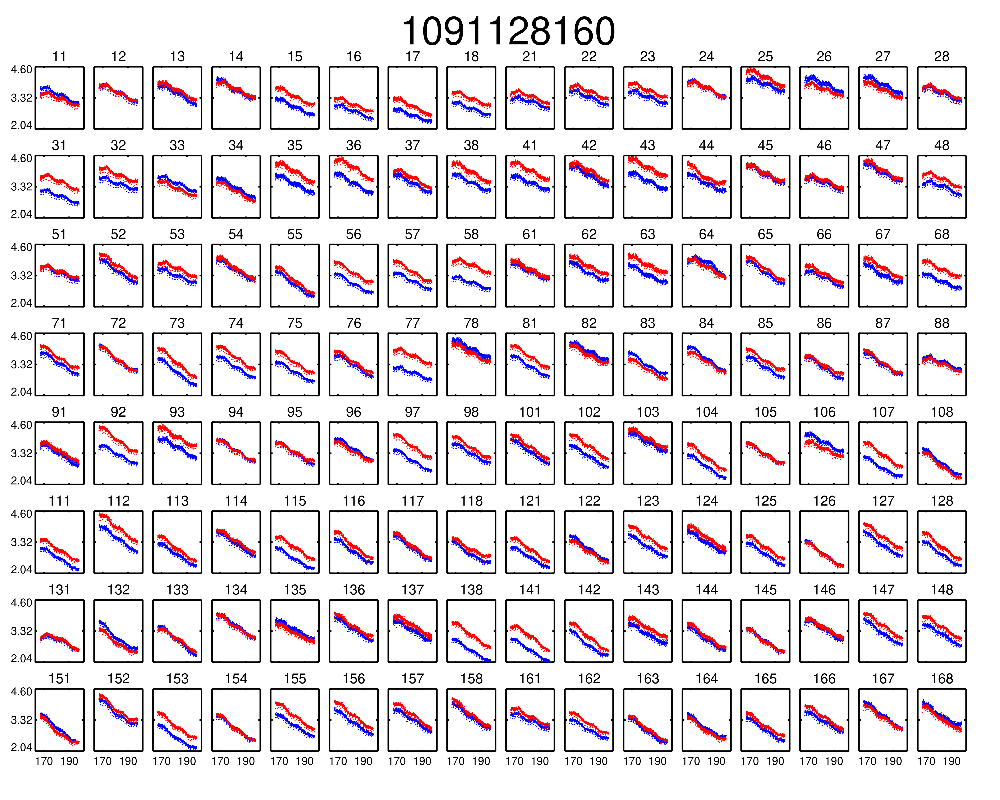

.. _MWA ASVO: https://asvo.mwatelescope.org/
.. _Birli: https://github.com/MWATelescope/Birli

Examples
===========

Preamble - Inputs and Outputs ``PyFHD``
----------------------------------------------------------

The input ``PyFHD`` requires at a minimum is the observation ID and a configuration file to be passed to ``configargparse`` using the ``-c`` option. 
By default ``PyFHD`` will search for a ``pyfhd.yaml`` configuration file in the directory you run ``PyFHD`` from, so strictly speaking, 
if you run ``PyFHD`` from a directory that contains a ``pyfhd.yaml`` file then only the observation ID is needed. It's assumed that the 
configuration file you provide has valid options for all the files you require, some files can be discovered automatically through the ``input-path``
option of ``PyFHD`` so read through the usage help text to work out how you wish to configure your input. ``PyFHD`` is rather flexible on how you do your input
as many of the files you may require can be in completely separate directories.

The output of ``PyFHD`` is automatically generated and stores everything in one directory with the name ``pyfhd_YYYY_MM_DD_HH_mm_ss`` if you don't use the ``--description`` option. 
In the case of using the ``--description`` option then the output directory generated will be ``pyfhd_your_description_here``. The path where the output directory will be generated is ``--output-path``,
with the generated output having the following directory structure (assuming 2 polarizations are used):

.. code-block:: bash

  .
  └── /path/to/the/output-path/
      └── pyfhd_your_description_here/
          ├── calibration/
          │   └── obs_id_cal.h5
          ├── checkpoints/
          │   ├── obs_checkpoint.h5
          │   ├── calibration_checkpoint.h5
          │   └── gridding_checkpoint.h5
          ├── gridding/
          │   ├── obs_id_image_uv.h5
          │   ├── obs_id_weights_uv.h5
          │   ├── obs_id_variance_uv.h5
          │   ├── obs_id_uniform_filter_uv.h5
          │   └── obs_id_model_uv.h5
          ├── healpix/
          │   ├── obs_id_hpx_even_XX.h5
          │   ├── obs_id_hpx_even_YY.h5
          │   ├── obs_id_hpx_odd_XX.h5
          │   ├── obs_id_hpx_odd_YY.h5
          │   └── uvf_grid/
          │       ├── obs_id_even_dirty_uv_arr_gridded_uvf.h5
          │       ├── obs_id_even_weights_uv_gridded_uvf.h5
          │       ├── obs_id_even_variance_uv_arr_gridded_uvf.h5
          │       ├── obs_id_even_model_uv_arr_gridded_uvf.h5
          │       ├── obs_id_odd_dirty_uv_arr_gridded_uvf.h5
          │       ├── obs_id_odd_weights_uv_gridded_uvf.h5
          │       ├── obs_id_odd_variance_uv_arr_gridded_uvf.h5
          │       └── obs_id_odd_model_uv_arr_gridded_uvf.h5
          ├── metadata/
          │   ├── obs_id_obs.h5
          │   └── obs_id_params.h5
          ├── plotting/
          │   ├── calibration/
          │   │   ├── cal_plot_1.png
          │   │   └── cal_plot_2.png
          │   ├── gridding/
          │   │   └── gridding_plot_1.png
          │   └── quickview/
          │       └── quickview_plot_1.png
          ├── visibilities/
          │   ├── obs_id_calibrated_vis_arr.h5
          │   └── obs_id_calibrated_vis_weights.h5
          ├── pyfhd_your_description_here_YYYY_MM_DD_HH_mm_ss.log
          ├── pyfhd_your_description_here_YYYY_MM_DD_HH_mm_ss.yaml
          └── pyfhd_your_description_here_YYYY_MM_DD_HH_mm_ss-final.yaml

The difference between the final and non-final yaml is that the final yaml is generated at the end of the run so you can observe any changes made to ``pyfhd_config``

Downloading MWA Data
---------------------
Data can be obtained via the `MWA ASVO`_ service (head to the webpage to get an account setup). There are multiple ways to download data (please refer to the `MWA ASVO`_ to learn more); here we will use the Web Dashboard as an example. 

``PyFHD`` uses a UVFITS file as input. The raw data out of the MWA telescope comes in a bespoke format, so we must convert the data into a UVFITS file. On the `MWA ASVO`_, login with your credentials, then head to 'My Jobs' in the top right corner, and click "New Data Job". Select the 'Visibility Conversion Job' tab as shown below:

.. image:: data_job_form.png
  :width: 800px

In this download we are using an observation with Observation ID (which is the GPS time) 1091128160. We choose to use `Birli`_ as the 'Preprocessor', and swap the 'Output' format to UVFITS. Click Submit to launch the job.

We also need a metafits tile, which we can access via the 'Visibility Download Job' tab. Input the Obs ID, and be sure to click the 'PPD, Metafits, and Flags' option like below (otherwise you download the raw data as well, which we don't need):

.. image:: meta_job_form.png
  :width: 800px

You can check the status of your download by clicking 'My Jobs' in the top left. Once they are ready to download, you'll see something like:

.. image:: jobs_ready.png
  :width: 800px

Running basic calibration (uses IDL)
-------------------------------------------

Full Pythonic calibration has not been implemented yet. In the interim, you can run limited calibration through ``PyFHD`` by using it as a wrapper to call ``FHD``. An extremely basic example is shown here:

.. code-block:: bash

    pyfhd \
        1091128160 \
        --input_path=data \
        --output_path=/place/for/outputs/ \
        --description=cal_data \
        --calibration_catalog_file_path=/path/to/sky_model/GLEAM_v2_plus_rlb2019.sav \
        --conserve_memory --memory_threshold=1000000000 \
        --IDL_calibrate

.. note:: This command took 260 minutes using 1 core of a Intel Gold 6140 processor and < 25GB RAM on the OzStar cluster

For this command to work, the following two inputs must exist:

.. code-block:: bash

  ./data/1091128160.uvfits # the input visibility data
  ./data/1091128160.metafits # the input metafits file

These paths are inferred from the observation number (1091128160) and ``--input-path`` argument. By including the ``--IDL_calibrate`` option, ``PyFHD`` will simply write out a ``.pro`` file (a format that can be fed directly into ``FHD``). ``PyFHD`` will fall back and use any default values as described by ``pyfhd --help``. Beyond those, we set the following arguments explicitly:

.. list-table::
   :widths: 25 25
   :header-rows: 1

   * - Argument
     - Meaning
   * - -\-calibration-catalog-file-path
     - Explicitly point to the sky model catalogue that we want to use
   * - -\-conserve-memory
     - Tells FHD that we want to limit large arrays to conserve memory
   * - -\-memory-threshold
     - Sets the memory threshold to 1GB

Using the ``--output-path`` and ``--description`` arguments sets the topmost output directory to ``/place/for/outputs/pyfhd_cal_data``. Upon successful running of this command, the output directory structure should look like this:

.. code-block:: bash

    /place/for/outputs/
    └── pyfhd_cal_data
      ├── fhd_calibration_only.pro        # used to run FHD
      ├── general_calibration_only.pro    # used to run FHD
      ├── pyfhd_config.pro                # used to run FHD
      ├── run_fhd_calibration_only.pro    # topmost file used to run FHD
      ├── pyfhd_cal_data_2022_12_12_17_19_58.log   # log with date and time (YY-MM-DD-hh-mm-ss) of run
      ├── pyfhd_cal_data_2022_12_12_17_19_58.yaml  # yaml containing all keywords used
      └── fhd_pyfhd_cal_data              # location for FHD outputs
        ├── 1091128160_variables.sav      # extra set of variables saved by PyFHD so python gridding can be run on these FHD outputs
        ├── beams                         # FHD outputs
        ├── calibration                   # FHD outputs
        ├── Healpix                       # FHD outputs
        ├── metadata                      # FHD outputs
        ├── output_data                   # FHD outputs
        ├── output_images                 # FHD outputs
        └── vis_data                      # FHD outputs

If you look in the ``/place/for/outputs/pyfhd_cal_data/fhd_pyfhd_cal_data/output_images`` you will find plots including the calibration amplitude and phases:

.. image:: 1091128160_cal_phase.png
  :width: 600px

We have solutions!

Running advanced calibration (uses IDL)
-------------------------------------------
.. todo::
   
   Check what this calibration is actually doing, and whether it is actually updating the solutions in the second part. The add motivation as to why we have to run in this manner

.. note:: This mode of running is intended for power users of ``FHD`` who already know what they want to run, but want to take advantage of ``PyFHD`` already.

Sometimes it makes sense to get an initial set of calibration solutions using one sky model, and then update them using a different sky model. First, run an initial calibration with default arguments:

.. code-block:: bash

    pyfhd \
        1088281328 \
        --input_path=data \
        --output_path=/place/for/outputs/ \
        --description=cal_data \
        --calibration_catalog_file_path=/path/to/sky_model/GLEAM_v2_plus_rlb2019.sav \
        --conserve_memory --memory_threshold=1000000000 \
        --IDL_calibrate

This results in calibration solutions that look somewhat ratty:

.. image:: 1088281328_cal_amp.png
  :width: 600px

.. image:: 1088281328_cal_phase.png
  :width: 600px

If you have a set of ``FHD`` ``IDL`` keywords to control calibration, you can simply add them into a text file (as they would appear in ``IDL``) and supply that text file as the argument to ``--IDL_keywords_file``. ``PyFHD`` will then copy these lines and add them into the ``.pro`` templates used to run ``FHD``. Here we'll update the calibration using a different sky model:

.. code-block:: bash

  time pyfhd \
    '1088281328' \
    --input_path=/fred/oz048/MWA/data/2014/van_vleck_corrected/coarse_corr_no_ao/ \
    --output_path=/fred/oz048/jline/ADACS/test_PyFHD/calibrate_real_data/ \
    --description=cal_data_advanced \
    --conserve_memory --memory_threshold=1000000000 \
    --IDL_calibrate \
    --IDL_variables_file fhd_variables.pro

where ``fhd_variables.pro`` looks like:

.. code-block:: idl

    pointing='-2'
    calibrate_visibilities=1
    return_cal_visibilities=1
    ;save_uvf=1
    noao_coarse=1
    model_visibilities=1
    model_transfer='/fred/oz048/MWA/CODE/FHD/fhd_nb_data_gd_woden_calstop/woden_models/combined/'
    conserve_memory=1e9
    recalculate_all=1
    mapfn_recalculate=0
    beam_nfreq_avg=1
    ps_kspan=200.
    transfer_psf='/fred/oz048/MWA/CODE/FHD/fhd_nb_data_pointing_beam/beams/gauss_beam_pointing'+pointing+'.sav'
    transfer_weights='/fred/oz048/MWA/CODE/FHD/fhd_nb_data_gd_woden_redo_redo/vis_data/'+obs_id+'_flags.sav'
    export_images=1
    force_data=1
    grid_recalculate=0
    transfer_calibration='/fred/oz048/MWA/CODE/FHD/fhd_nb_data_gd_woden_calstop/cal_transfer/'+obs_id+'_cal.sav'
    restrict_hpx_inds='EoR0_high_healpix_inds_3x.idlsave'
    interpolate_kernel=1
    psf_dim=30
    ;54 on 1e6 mask with -2, 62 on 1e7 with -2
    beam_gaussian_decomp=1
    psf_image_resolution=10.
    psf_resolution=50.
    ;54*250=13500 pixel side and 300sec fit, 54*50=2700 pixel side and 280sec fit
    beam_mask_threshold=1e6
    save_beam_metadata_only=1
    beam_clip_floor=0

This advanced calibration is transferring an initial set of calibration solutions (using ``transfer_calibration``) and running calibration again using an existing sky model (using ``model_transfer``). Amongst other things, it's also using a different primary beam model via the keyword ``transfer_psf``, and a pervious set of flags via ``transfer_weights``. This calibration results in tighter amplitude and flatter phase solutions:

.. image:: 1088281328_cal_amp_advanced.png
  :width: 600px

.. image:: 1088281328_cal_phase_advanced.png
  :width: 600px

Gridding IDL calibration outputs
-------------------------------------------

.. note::

   When performing gridding, the gridding kernel object is often large and complex. As such, reading and converting from the native ``IDL`` ``.sav`` binary format should only be done once, and saved into a numpy ``.npz``. An example ``python`` code snippet to do exactly this is:

   .. code-block:: python

      from scipy.io import readsav
      import numpy as np
      sav_dict = readsav('gauss_beam_pointing-2.sav', python_dict=True)
      np.savez('gauss_beam_pointing-2.npz', **sav_dict)

   Be aware this can take hours.

.. todo::
  Work out a way to share the converted ``.sav`` kernels
   

In this example, calibration should already have been run using ``FHD``. We will then take the calibrated visibilities/model and grid them into two groups: even and odd time steps. This is the first step towards creating a power spectrum (:math:`\varepsilon`\ *ppsilon* uses the difference between the even and odd to estimate the noise).

.. code-block:: bash

   pyfhd \
       '1088281328' \
       --input-path /path/to/data/ \
       --output-path /current/working/directory/ \
       --description my_first_run \
       --grid-psf-file /path/to/beams/gauss_beam_pointing-2.npz \
       --ps-kspan=200 \
       --grid_IDL_outputs

For this command to work, the raw data (which ``FHD`` needs to work out some metadata-type things) should exist as specified above as::

    /path/to/data/1088281328.uvfits

The following ``FHD`` outputs must also exist, in these locations:

.. code-block:: bash

    /current/working/directory
    └── pyfhd_my_first_run
      └── fhd_pyfhd_my_first_run
        ├── 1088281328_variables.sav
        ├── metadata
        | ├── 1088281328_obs.sav
        | └── 1088281328_params.sav
        └── vis_data
          ├── 1088281328_vis_XX.sav
          ├── 1088281328_vis_YY.sav
          ├── 1088281328_vis_model_XX.sav
          ├── 1088281328_vis_model_YY.sav
          └── 1088281328_flags.sav 

Other than specifying file paths, the other necessary arguments have the following effect:

.. list-table::
   :widths: 25 25
   :header-rows: 1

   * - Argument
     - Meaning
   * - -\-grid-psf-file
     - A converted ``FHD`` ``psf`` object to use as a gridding kernel
   * - -\-ps-kspan=200
     - Set the width of the gridded visibilities (wavelengths)
   * - -\-grid_IDL_outputs
     - Switches on gridding using ``FHD`` outputs

Once run, this will produce the following outputs:

.. code-block:: bash

   /current/working/directory
   └── pyfhd_my_first_run
     └── gridding_outputs
         ├── 1088281328_gridded_uv_cube_even_XX.h5
         ├── 1088281328_gridded_uv_cube_even_YY.h5
         ├── 1088281328_gridded_uv_cube_odd_XX.h5
         └── 1088281328_gridded_uv_cube_odd_YY.h5

These files contain the gridded data sets, with each frequency slice being a separate ``hdf5`` data object within the relevant file.

Image gridded outputs and project to Healpix (uses IDL)
----------------------------------------------------------
Assuming we have run ``PyFHD`` to grid some visibilities (as detailed in `Gridding IDL calibration outputs`_ above), in this example we will use ``FHD`` to image and project them to Healpix. These outputs can then be input into :math:`\varepsilon`\ *ppsilon*. The example command is:

.. code-block:: bash

   pyfhd \
       '1088281328' \
       --input-path /path/to/data/ \
       --output-path /current/working/directory/ \
       --description my_first_run \
       --grid-psf-file /path/to/beams/gauss_beams_pointing-2.sav \
       --ps-kspan=200 \
       --IDL_healpix_gridded_outputs

Note that unlike in the `Gridding IDL calibration outputs`_ example, this time we point ``--grid-psf-file`` towards an ``IDL`` save file. This is because ``FHD`` needs to access the ``psf`` object within, and ``IDL`` cannot read the ``numpy`` format. This command will write a number of ``.pro`` files to launch ``FHD``, with a small amount of extra code to read in the gridded ``hdf5`` files. For those interested, the template is in ``PyFHD/PyFHD/templates/vis_model_freq_split_read_python.pro``.

Once this code is run, the following outputs are created:

.. code-block:: bash

   /current/working/directory
   └── fhd_pyfhd_my_first_run
     └── Healpix
         ├── 1088281328_even_cubeXX.sav
         ├── 1088281328_even_cubeYY.sav
         ├── 1088281328_odd_cubeXX.sav
         └── 1088281328_odd_cubeYY.sav

Both grid and image/project to Healpix
----------------------------------------
It is straight forward to run the gridding and imaging/healpix projection (detailed in examples `Gridding IDL calibration outputs`_ and `Image gridded outputs and project to Healpix (uses IDL)`_ above) in a single command:

.. code-block:: bash

   pyfhd \
       '1088281328' \
       --input-path /path/to/data/ \
       --output-path /current/working/directory/ \
       --description my_first_run \
       --grid-psf-file /path/to/beams/gauss_beam_pointing-2.npz \
                       /path/to/beams/gauss_beams_pointing-2.sav \
       --ps-kspan=200 \
       --grid_IDL_outputs \
       --IDL_healpix_gridded_outputs

The important thing to note is that we supply both the ``.npz`` and ``.sav`` format beams to the ``--grid-psf-file``, which keeps both ``Python`` and ``IDL`` happy.