.. _MWA ASVO: https://asvo.mwatelescope.org/
.. _Birli: https://github.com/MWATelescope/Birli
.. _WODEN: https://woden.readthedocs.io/en/latest/index.html
.. _FHD: https://github.com/EoRImaging/FHD

Tutorial
=========

Let's start with getting you off the ground and running using the sample data built into ``PyFHD``. 
The example data is a small subset of the observation ``1088285600`` with a beam that uses only one frequency, 
and a skymodel created using `WODEN`_. To run ``PyFHD`` you use the CLI, built with ``configargparse``
which allows you to take in configuration files. The command below assumes you're running from inside the root directory of the repository.

.. code-block:: bash

  pyfhd -c ./input/1088285600_example/1088285600_example.yaml 1088285600

The command on most machines takes 1-2 minutes to run, and the output is stored in the ``output`` directory. More details on the exact inputs and outputs is clarified in the next section.

The Required Inputs and the outputs of ``PyFHD``
----------------------------------------------------------

The input ``PyFHD`` requires at a minimum is the observation ID and a configuration file to be passed to ``configargparse`` using the ``-c`` option.
By default ``PyFHD`` will search for a ``pyfhd.yaml`` configuration file in the directory you run ``PyFHD`` from, so strictly speaking,
if you run ``PyFHD`` from a directory that contains a ``pyfhd.yaml`` file then only the observation ID is needed.

It's assumed that the configuration file you provide has valid options for all the files you require, some files can be discovered automatically through the ``input-path``
option of ``PyFHD`` so read through the usage help text to work out how you wish to configure your input. ``PyFHD`` is rather flexible on how you do your input
as many of the files you may require can be in completely separate directories.

The output of ``PyFHD`` is automatically generated and stores everything in one directory with the name ``pyfhd_YYYY_MM_DD_HH_mm_ss`` if you don't use the ``--description`` option.
In the case of using the ``--description`` option then the output directory generated will be ``pyfhd_your_description_here``. The example run we used above uses the ``--description`` as ``'1088285600_example'``
option so the output directory generated will be ``pyfhd_1088285600_example``. The path where the output directory will be generated is ``--output-path`` (by default ``./output``), assuming you're looking at the example run above,
the output directory structure will look like this:

.. code-block:: bash

  output
  └── pyfhd_1088285600_example
      ├── calibration
      │   └── 1088285600_cal.h5
      ├── checkpoints
      │   ├── 1088285600_example_calibration_checkpoint.h5
      │   ├── 1088285600_example_gridding_checkpoint.h5
      │   └── 1088285600_example_obs_checkpoint.h5
      ├── config
      │   ├── pyfhd_1088285600_example_2025_04_17_11_47_12-final.yaml
      │   ├── pyfhd_1088285600_example_2025_04_17_11_47_12.yaml
      │   └── pyfhd_config.h5
      ├── fits
      │   ├── 1088285600_beam_XX.fits
      │   ├── 1088285600_beam_YY.fits
      │   ├── 1088285600_uniform_dirty_XX.fits
      │   ├── 1088285600_uniform_dirty_YY.fits
      │   ├── 1088285600_uniform_model_XX.fits
      │   ├── 1088285600_uniform_model_YY.fits
      │   ├── 1088285600_uniform_residual_XX.fits
      │   ├── 1088285600_uniform_residual_YY.fits
      │   ├── 1088285600_uv_weights_XX.fits
      │   └── 1088285600_uv_weights_YY.fits
      ├── gridding
      │   ├── 1088285600_image_uv.h5
      │   ├── 1088285600_model_uv.h5
      │   ├── 1088285600_uniform_filter_uv.h5
      │   ├── 1088285600_variance_uv.h5
      │   └── 1088285600_weights_uv.h5
      ├── healpix
      │   ├── 1088285600_hpx_even_XX.h5
      │   ├── 1088285600_hpx_even_YY.h5
      │   ├── 1088285600_hpx_odd_XX.h5
      │   ├── 1088285600_hpx_odd_YY.h5
      │   └── uvf_grid
      │       ├── 1088285600_even_XX_dirty_uv_arr_gridded_uvf.h5
      │       ├── 1088285600_even_XX_model_uv_arr_gridded_uvf.h5
      │       ├── 1088285600_even_XX_variance_uv_arr_gridded_uvf.h5
      │       ├── 1088285600_even_XX_weights_uv_gridded_uvf.h5
      │       ├── 1088285600_even_YY_dirty_uv_arr_gridded_uvf.h5
      │       ├── 1088285600_even_YY_model_uv_arr_gridded_uvf.h5
      │       ├── 1088285600_even_YY_variance_uv_arr_gridded_uvf.h5
      │       ├── 1088285600_even_YY_weights_uv_gridded_uvf.h5
      │       ├── 1088285600_odd_XX_dirty_uv_arr_gridded_uvf.h5
      │       ├── 1088285600_odd_XX_model_uv_arr_gridded_uvf.h5
      │       ├── 1088285600_odd_XX_variance_uv_arr_gridded_uvf.h5
      │       ├── 1088285600_odd_XX_weights_uv_gridded_uvf.h5
      │       ├── 1088285600_odd_YY_dirty_uv_arr_gridded_uvf.h5
      │       ├── 1088285600_odd_YY_model_uv_arr_gridded_uvf.h5
      │       ├── 1088285600_odd_YY_variance_uv_arr_gridded_uvf.h5
      │       └── 1088285600_odd_YY_weights_uv_gridded_uvf.h5
      ├── layout.h5
      ├── metadata
      │   ├── 1088285600_obs.h5
      │   └── 1088285600_params.h5
      ├── plots
      │   └── calibration
      │       ├── 1088285600_cal_amp.png
      │       ├── 1088285600_cal_phase.png
      │       ├── 1088285600_cal_raw_amp.png
      │       ├── 1088285600_cal_raw_phase.png
      │       ├── 1088285600_cal_residual_amp.png
      │       └── 1088285600_cal_residual_phase.png
      ├── pyfhd_1088285600_example_2025_04_17_11_47_12.log
      └── visibilities
          ├── 1088285600_calibrated_vis_arr.h5
          ├── 1088285600_calibrated_vis_weights.h5
          ├── 1088285600_raw_vis_arr.h5
          └── 1088285600_raw_vis_weights.h5

The difference between the final and non-final yaml is that the final yaml is generated at the end of the run so you can observe any changes made to ``pyfhd_config``, the config is also saved as a HDF5 file at the end of the run.
Changes may happen due to conflicts in the options of your configuration file, if they are minor that's when the configuration will change and you should see the change mentioned in the log file.
Most of the directories should be self explanatory, but there are two I wish to explain in more detail.

First the ``plots`` directory, for the plots directory, the intent is to store all the plots generated by ``PyFHD`` in there,
with a directory for plots generated for each part of the pipeline. For example, if you wish to add diagnostic plots for ``gridding`` as a PyFHD developer, then the policy is to create a ``gridding`` directory in ``plots`` directory
and store your plots generated from ``gridding`` there. If the plots aren't generated in ``gridding`` but are related to ``gridding`` then those plots should also go into the ``gridding`` subdirectory.

The second directory I want to explain is the ``checkpoints`` directory, please read on to the next section for this explaantion.

Checkpointing
-------------
The checkpointing system in ``PyFHD`` is designed to save the state of the pipeline after important, potentially long running steps.
The checkpoints are store in the ``checkpoints`` directory and they are saved at th fopllowing points:

- ``obs_checkpoint`` - ``obs`` dict creation, reading of visibilities and weights, creation of the ``params`` dict
- ``calibration_checkpoint`` - End of calibration, creation of the ``cal`` dict which holds the calculated gains, metadata etc, the skymodel after being imported and the weights which have been updated after calibration.
- ``gridding_checkpoint`` - End of gridding, creation of the ``gridding`` dict which holds the gridded visibilities and associated weights, variances, models, etc

In the case that you wish to skip a step in the pipeline, you can use the ``--calibrate-checkpoint`` or ``--grid-checkpoint`` options to skip the calibration or gridding steps respectively. 

.. attention::
  The ``--obs-checkpoint`` and ``--calibrate-checkpoint`` will check for each other's existence and if both are used ``--calibrate-checkpoint`` will be prioritised and ``obs-checkpoint`` will be ignored.

In the below example we will run ``PyFHD`` with the ``--calibrate-checkpoint`` option, which will skip the calibration and visibility step and go straight to gridding. 

.. code-block:: bash

  pyfhd -c ./input/1088285600_example/1088285600_example.yaml --calibrate-checkpoint ./output/pyfhd_1088285600_example/checkpoints/1088285600_example_calibrate_checkpoint.h5 1088285600 

Within the logs of the ``PyFHD`` you should see the following message::

  yyyy-mm-dd HH:MM:SS - INFO:
        Checkpoint Loaded: Calibrated and Flagged visibility parameters, array and weights, the flagged observation metadata dictionary and the calibration dictionary loaded from output/pyfhd_1088285600_example/calibrate_checkpoint.h5

Configuration
-------------
We have shown that you can adjust the configuration of ``PyFHD`` using command like arguments like ``--calibrate-checkpoint`` and ``-c`` / ``--config``, however we have mentioned that we used `ConfigArgParse <https://pypi.org/project/ConfigArgParse/>`_
to allow the use of ``YAML`` files. Inside the repository we have 2 examples of configuration files, one is in the root of the repository and is the template yaml file, ``pyfhd.yaml``, use this to create your own configuration file. Alternatively, you can
use the example configuration file ``1088285600_example.yaml`` in the ``input/1088285600_example`` directory to build your configuration file. 
All of these options replace the `dictionary.md <https://github.com/EoRImaging/FHD/blob/master/dictionary.md>`_ file that used in `FHD`_, most of the options come from `FHD`_, however some of the options are new specific to ``PyFHD`` and
some have been renamed from `FHD`_ and in the case of being renamed, the old name is referenced inside the help text of the option.

Most of the options are numbers, lists of numbers, strings or list of strings, however some of the options are booleans. These booleans will have at minimum two arguments that target the one option, one is the option itself,
for example, ``--silent`` which when used will set the ``silent`` option to ``True``, and ``--no-silent`` which when used will set the ``silent`` option to ``False``. All boolean options have the ``no-`` prefix available to you,
in case you wish to temporarily negate the options set in the configuration file via the command line. 

.. tip::

  The hierarchy of the configuration in PyFHD is as follows:

  .. code-block:: 

         Code
          ⬇️
      Command Line
          ⬇️
         YAML
  
  The command line argument will override the YAML file, and the code will override the command line argument in certain situations.
  In situations where the code overrides the command line (or YAML), it's generally if a warning is triggered or some error is found, although
  we try to avoid these when we can. If no warning is logged when the code overrides the YAML or command line options, either add
  the warning to the code yourself and do a Pull request or open an issue on the repository.

If you wish to see all the options ``PyFHD`` has available, find them in one of the following places:

CLI
+++
  .. code-block:: bash

    pyfhd --help # -h also works, you're welcome to use either, you know how it should be.

    usage: PyFHD [-h] [-c CONFIG] [-v] [-i INPUT_PATH] [-r] [-s] [-l] [--instrument {mwa}] [--dimension DIMENSION] [--elements ELEMENTS] [--kbinsize KBINSIZE] [--FoV FOV] [--deproject_w_term DEPROJECT_W_TERM] [--conserve-memory]
                [--memory-threshold MEMORY_THRESHOLD] [--min-baseline MIN_BASELINE] [--n-pol {0,2,4}] [--save-checkpoints] [--obs-checkpoint OBS_CHECKPOINT] [--calibrate-checkpoint CALIBRATE_CHECKPOINT] [--gridding-checkpoint GRIDDING_CHECKPOINT]
                ...

Read The Docs
++++++++++++++

Go to the Usage section inside the API Documentation and you will see the full list of options available to you. The usage is generated using `sphinx <https://www.sphinx-doc.org/en/master/>`_.

Find them Here: :doc:`Usage <../documentation/documentation>`

``PyFHD.pyfhd_tools.pyfhd_setup.pyfhd_parser()``
+++++++++++++++++++++++++++++++++++++++++++++++++

You can also find the options in the ``pyfhd_setup.py`` file, this is the file that is used to generate the command line interface and the configuration file.
Specifically look for the ``pyfhd_parser()`` function. 
You can see the source here: `pyfhd_parser <../_modules/PyFHD/pyfhd_tools/pyfhd_setup.html#pyfhd_parser>`_

Downloading MWA Data
---------------------
Data can be obtained via the `MWA ASVO`_ service (head to the webpage to get an account setup). There are multiple ways to download data (please refer to the `MWA ASVO`_ to learn more); here we will use the Web Dashboard as an example.

``PyFHD`` uses a UVFITS file as input. The raw data out of the MWA telescope comes in a bespoke format, so we must convert the data into a UVFITS file. On the `MWA ASVO`_, login with your credentials, then head to 'My Jobs' in the top right corner, and click "New Data Job". Select the 'Visibility Conversion Job' tab as shown below:

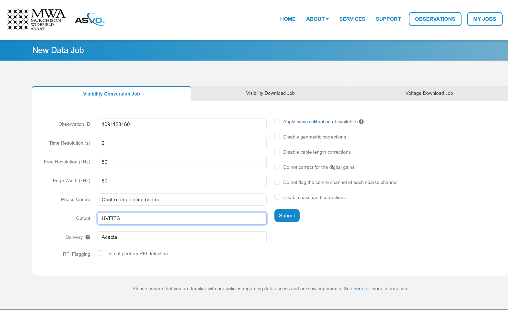

In this download we are using an observation with Observation ID (which is the GPS time) 1091128160. We choose to use `Birli`_ as the 'Preprocessor', and swap the 'Output' format to UVFITS. Click Submit to launch the job.

We also need a metafits tile, which we can access via the 'Visibility Download Job' tab. Input the Obs ID, and be sure to click the 'PPD, Metafits, and Flags' option like below (otherwise you download the raw data as well, which we don't need):

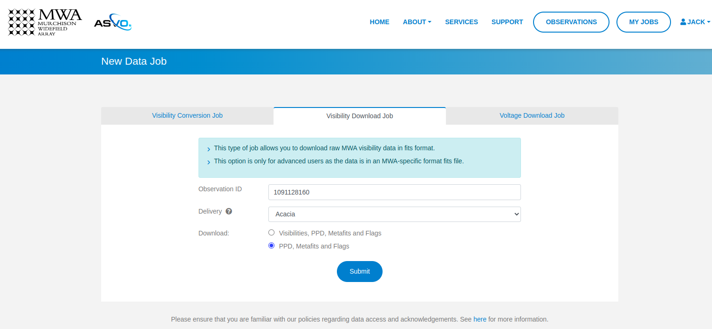

You can check the status of your download by clicking 'My Jobs' in the top left. Once they are ready to download, you'll see something like:

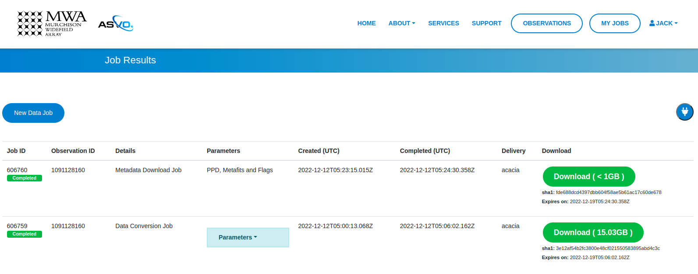

Running basic calibration
-------------------------

Calibration is fully available in ``PyFHD`` and can be enabled using the ``--calibrate-visibilities`` option being set to true. Most of the options for calibration are found under the 
`Calibration <../documentation/documentation.html#PyFHD.pyfhd_tools.pyfhd_setup-pyfhd_parser-calibration>`_ group in the argument parser. 
The first example we'll do is the a calibration of the sample data using only the command line interface to show the options that changed
in comparison to the template in the root of the repository (which will be used by default here):

.. code-block:: bash

  pyfhd \
    --input-path "./input/1088285600_example/" \
    --beam-file-path "./input/1088285600_example/gauss_beam_pointing0_167635008Hz.h5" \
    --beam-offset-time 0 \
    --no-cable-bandpass-fit \
    --no-cal-reflection-hyperresolve \
    --cal-reflection-mode-theory 0 \
    --no-calibration-auto-initialize \
    --no-vis-baseline-hist \
    --no-digital-gain-jump-polyfit \
    --no-return-cal-visibilities \
    --cal-stop \
    --no-flag-frequencies \
    --description "1088285600_example_cal_stop" \
    --model-file-type "uvfits" \
    --model-file-path "./input/1088285600_example/1088285600_model.uvfits" \
    1088285600

Here you some some solutions from the calibration of the sample data:

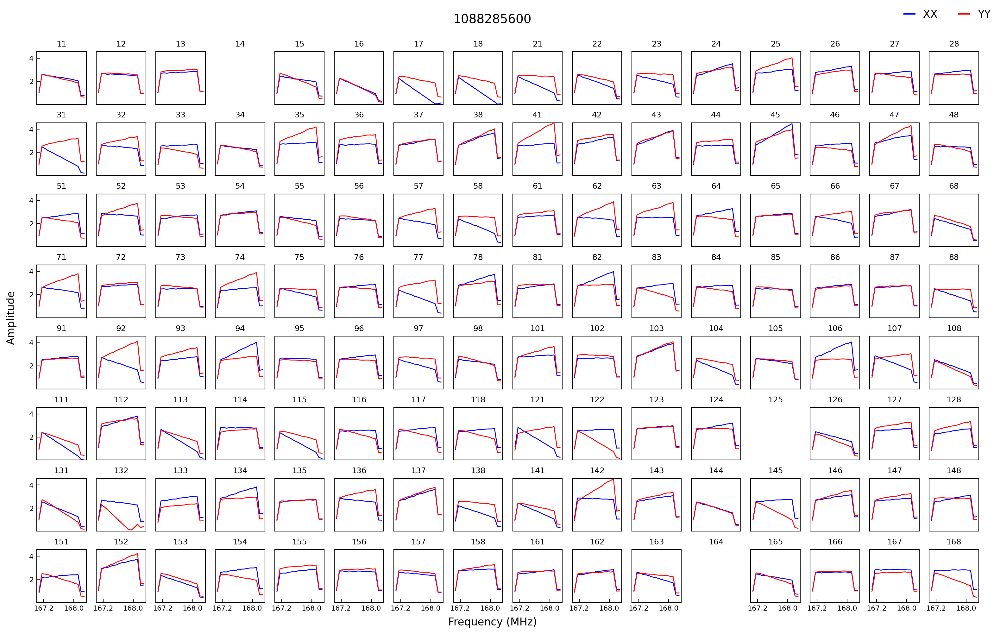

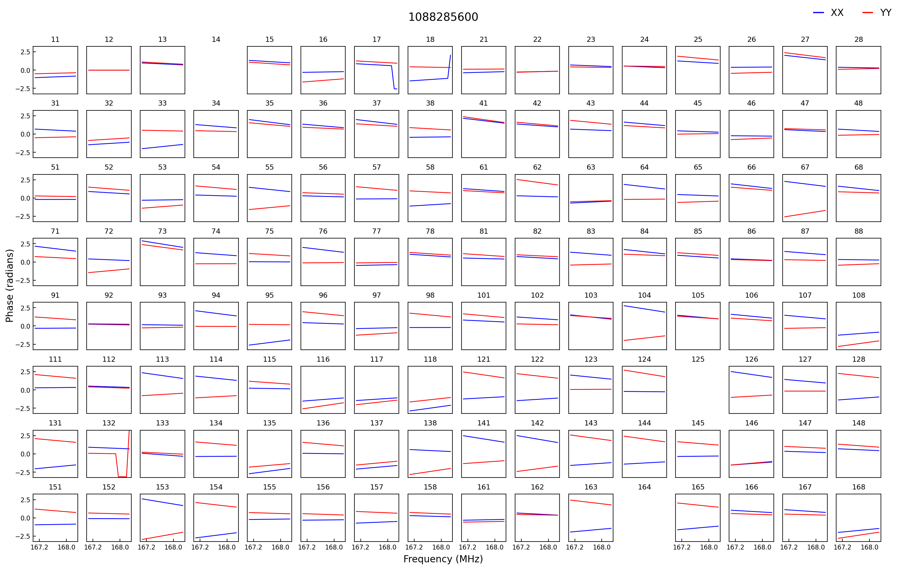

TODO: Do PyFHD run with 1091128160 and show the output

.. code-block:: bash

    pyfhd \
        1091128160 \
        --input_path=data \
        --output_path=/place/for/outputs/ \
        --description=cal_data \
        --calibration_catalog_file_path=/path/to/sky_model/GLEAM_v2_plus_rlb2019.sav \
        --conserve_memory --memory_threshold=1000000000 \
        --IDL_calibrate

.. note:: This command took 260 minutes using 1 core of a Intel Gold 6140 processor and < 25GB RAM on the OzStar cluster

For this command to work, the following two inputs must exist:

.. code-block:: bash

  ./data/1091128160.uvfits # the input visibility data
  ./data/1091128160.metafits # the input metafits file

These paths are inferred from the observation number (1091128160) and ``--input-path`` argument. By including the ``--IDL_calibrate`` option, ``PyFHD`` will simply write out a ``.pro`` file (a format that can be fed directly into ``FHD``). ``PyFHD`` will fall back and use any default values as described by ``pyfhd --help``. Beyond those, we set the following arguments explicitly:

.. list-table::
   :widths: 25 25
   :header-rows: 1

   * - Argument
     - Meaning
   * - -\-calibration-catalog-file-path
     - Explicitly point to the sky model catalogue that we want to use
   * - -\-conserve-memory
     - Tells FHD that we want to limit large arrays to conserve memory
   * - -\-memory-threshold
     - Sets the memory threshold to 1GB

Using the ``--output-path`` and ``--description`` arguments sets the topmost output directory to ``/place/for/outputs/pyfhd_cal_data``. Upon successful running of this command, the output directory structure should look like this:

.. code-block:: bash

    /place/for/outputs/
    └── pyfhd_cal_data
      ├── fhd_calibration_only.pro        # used to run FHD
      ├── general_calibration_only.pro    # used to run FHD
      ├── pyfhd_config.pro                # used to run FHD
      ├── run_fhd_calibration_only.pro    # topmost file used to run FHD
      ├── pyfhd_cal_data_2022_12_12_17_19_58.log   # log with date and time (YY-MM-DD-hh-mm-ss) of run
      ├── pyfhd_cal_data_2022_12_12_17_19_58.yaml  # yaml containing all keywords used
      └── fhd_pyfhd_cal_data              # location for FHD outputs
        ├── 1091128160_variables.sav      # extra set of variables saved by PyFHD so python gridding can be run on these FHD outputs
        ├── beams                         # FHD outputs
        ├── calibration                   # FHD outputs
        ├── Healpix                       # FHD outputs
        ├── metadata                      # FHD outputs
        ├── output_data                   # FHD outputs
        ├── output_images                 # FHD outputs
        └── vis_data                      # FHD outputs

If you look in the ``/place/for/outputs/pyfhd_cal_data/fhd_pyfhd_cal_data/output_images`` you will find plots including the calibration amplitude and phases:

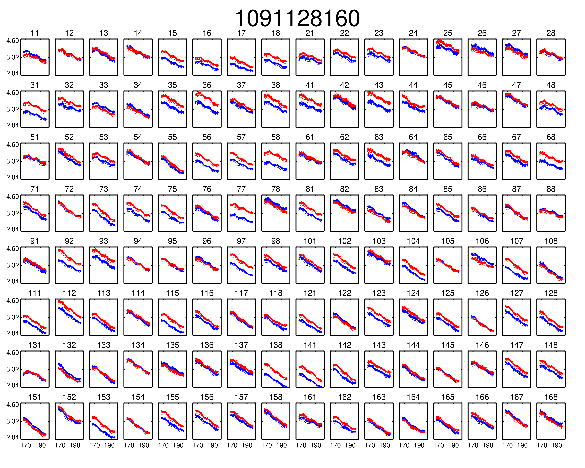

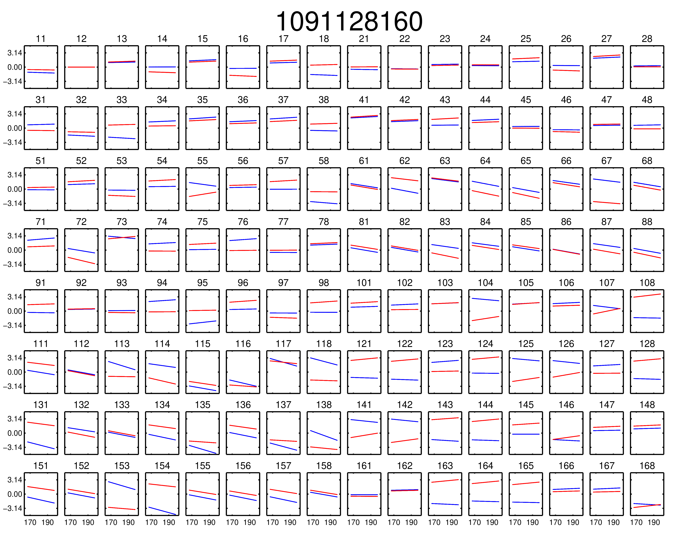

We have solutions!

Running advanced calibration (uses IDL)
-------------------------------------------
.. todo::
   
   Check what this calibration is actually doing, and whether it is actually updating the solutions in the second part. The add motivation as to why we have to run in this manner

.. note:: This mode of running is intended for power users of ``FHD`` who already know what they want to run, but want to take advantage of ``PyFHD`` already.

Sometimes it makes sense to get an initial set of calibration solutions using one sky model, and then update them using a different sky model. First, run an initial calibration with default arguments:

.. code-block:: bash

    pyfhd \
        1088281328 \
        --input_path=data \
        --output_path=/place/for/outputs/ \
        --description=cal_data \
        --calibration_catalog_file_path=/path/to/sky_model/GLEAM_v2_plus_rlb2019.sav \
        --conserve_memory --memory_threshold=1000000000 \
        --IDL_calibrate

This results in calibration solutions that look somewhat ratty:

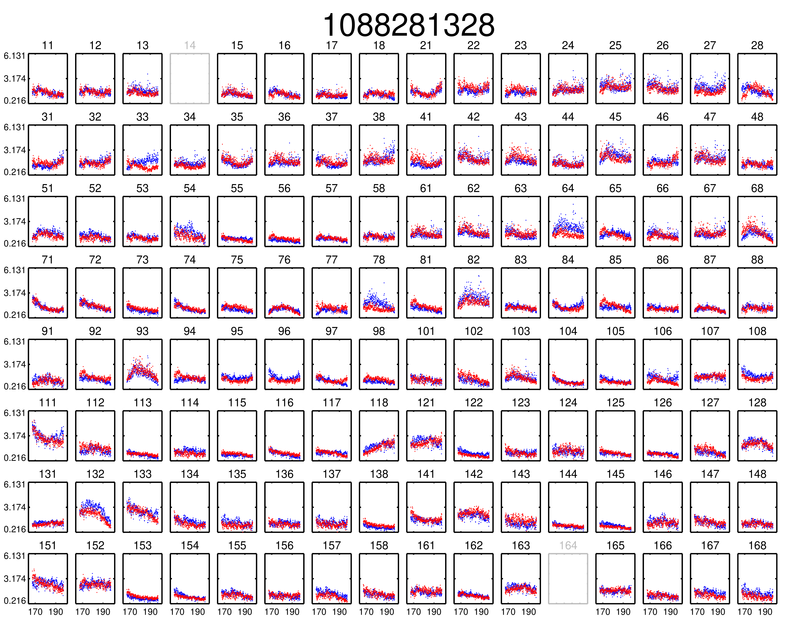

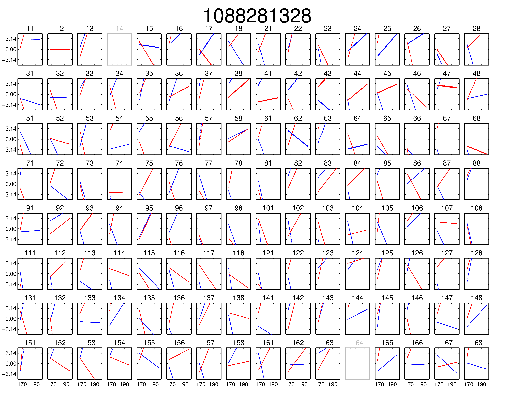

If you have a set of ``FHD`` ``IDL`` keywords to control calibration, you can simply add them into a text file (as they would appear in ``IDL``) and supply that text file as the argument to ``--IDL_keywords_file``. ``PyFHD`` will then copy these lines and add them into the ``.pro`` templates used to run ``FHD``. Here we'll update the calibration using a different sky model:

.. code-block:: bash

  time pyfhd \
    '1088281328' \
    --input_path=/fred/oz048/MWA/data/2014/van_vleck_corrected/coarse_corr_no_ao/ \
    --output_path=/fred/oz048/jline/ADACS/test_PyFHD/calibrate_real_data/ \
    --description=cal_data_advanced \
    --conserve_memory --memory_threshold=1000000000 \
    --IDL_calibrate \
    --IDL_variables_file fhd_variables.pro

where ``fhd_variables.pro`` looks like:

.. code-block:: idl

    pointing='-2'
    calibrate_visibilities=1
    return_cal_visibilities=1
    ;save_uvf=1
    noao_coarse=1
    model_visibilities=1
    model_transfer='/fred/oz048/MWA/CODE/FHD/fhd_nb_data_gd_woden_calstop/woden_models/combined/'
    conserve_memory=1e9
    recalculate_all=1
    mapfn_recalculate=0
    beam_nfreq_avg=1
    ps_kspan=200.
    transfer_psf='/fred/oz048/MWA/CODE/FHD/fhd_nb_data_pointing_beam/beams/gauss_beam_pointing'+pointing+'.sav'
    transfer_weights='/fred/oz048/MWA/CODE/FHD/fhd_nb_data_gd_woden_redo_redo/vis_data/'+obs_id+'_flags.sav'
    export_images=1
    force_data=1
    grid_recalculate=0
    transfer_calibration='/fred/oz048/MWA/CODE/FHD/fhd_nb_data_gd_woden_calstop/cal_transfer/'+obs_id+'_cal.sav'
    restrict_hpx_inds='EoR0_high_healpix_inds_3x.idlsave'
    interpolate_kernel=1
    psf_dim=30
    ;54 on 1e6 mask with -2, 62 on 1e7 with -2
    beam_gaussian_decomp=1
    psf_image_resolution=10.
    psf_resolution=50.
    ;54*250=13500 pixel side and 300sec fit, 54*50=2700 pixel side and 280sec fit
    beam_mask_threshold=1e6
    save_beam_metadata_only=1
    beam_clip_floor=0

This advanced calibration is transferring an initial set of calibration solutions (using ``transfer_calibration``) and running calibration again using an existing sky model (using ``model_transfer``). Amongst other things, it's also using a different primary beam model via the keyword ``transfer_psf``, and a pervious set of flags via ``transfer_weights``. This calibration results in tighter amplitude and flatter phase solutions:

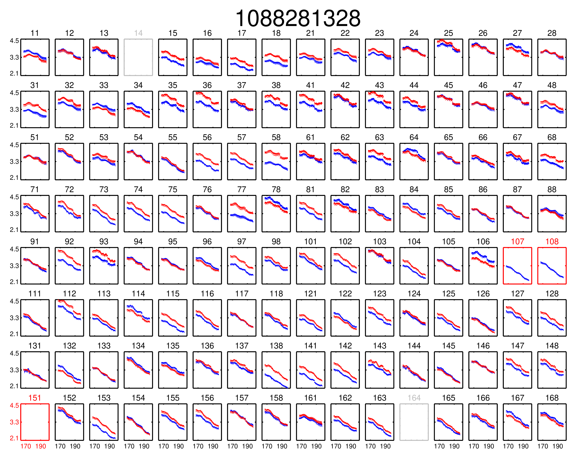

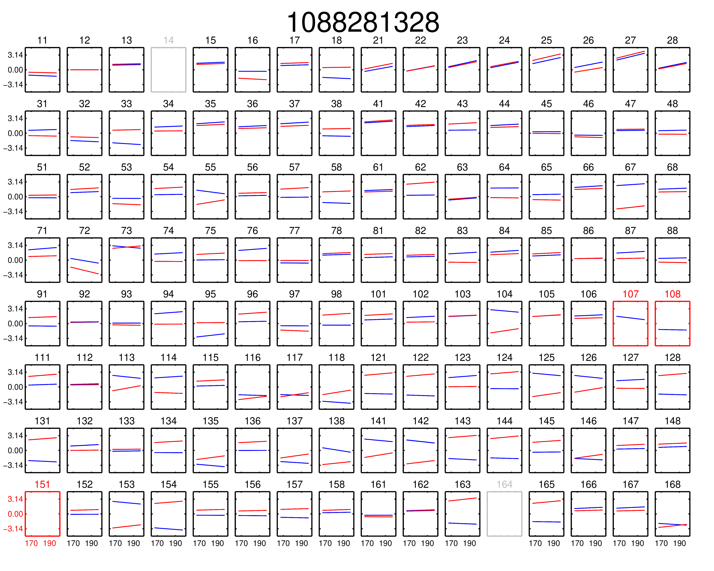

Gridding 
---------

.. note::
  
  Performing gridding in PyFHD, requires you to import a beam, the beams that are currently supported are those generated by ``FHD``, however, ``PyFHD`` has nothing currently to do the beam forming. This is being worked on
  using ``UVBeam`` from ``pyuvdata``. Reading in a sav file is done using ``scipy.io.readsav`` and the beam is converted to a numpy complex array, however for large beams this can take a long time and can use a lot of memory,
  so it should only be done once. ``PyFHD`` will save convert any beam ``sav`` file into a ``HDF5`` file, in the same location as the ``sav`` file. 

Running the gridding step in ``PyFHD`` is relatively simple as its enabled by default, and the small number of options available to you are found in the `Gridding <../documentation/documentation.html#PyFHD.pyfhd_tools.pyfhd_setup-pyfhd_parser-gridding>`_ section of the argument parser.

We'll use the calibrate-checkpoint example earlier to run it:

.. code-block:: bash

  pyfhd -c ./input/1088285600_example/1088285600_example.yaml --calibrate-checkpoint ./output/pyfhd_1088285600_example/checkpoints/1088285600_example_calibrate_checkpoint.h5 1088285600 

This would be the same as runnning the command below:

.. code-block:: bash

  pyfhd \
    --input-path "./input/1088285600_example/" \
    --description "1088285600_example"
    --beam-file-path "./input/1088285600_example/gauss_beam_pointing0_167635008Hz.h5" 
    --calibrate-checkpoint "./output/pyfhd_1088285600_example/checkpoints/1088285600_example_calibrate_checkpoint.h5" \
    --recalculate-grid \
    --image-filter 'filter_uv_uniform' \
    --no-mask-mirror-indices \
    --no-grid-spectral \
    --grid-weights \
    --grid-variance \
    --no-grid-uniform \
    --ps-kspan 200

TODO: Add Gridding plot output to the example, check with nichole

TODO: Add more advanced grididng example with 1088281328
   

.. In this example, calibration should already have been run using ``FHD``. We will then take the calibrated visibilities/model and grid them into two groups: even and odd time steps. This is the first step towards creating a power spectrum (:math:`\varepsilon`\ *ppsilon* uses the difference between the even and odd to estimate the noise).

.. .. code-block:: bash

..    pyfhd \
..        '1088281328' \
..        --input-path /path/to/data/ \
..        --output-path /current/working/directory/ \
..        --description my_first_run \
..        --grid-psf-file /path/to/beams/gauss_beam_pointing-2.npz \
..        --ps-kspan=200 \
..        --grid_IDL_outputs

.. For this command to work, the raw data (which ``FHD`` needs to work out some metadata-type things) should exist as specified above as::

..     /path/to/data/1088281328.uvfits

.. The following ``FHD`` outputs must also exist, in these locations:

.. .. code-block:: bash

..     /current/working/directory
..     └── pyfhd_my_first_run
..       └── fhd_pyfhd_my_first_run
..         ├── 1088281328_variables.sav
..         ├── metadata
..         | ├── 1088281328_obs.sav
..         | └── 1088281328_params.sav
..         └── vis_data
..           ├── 1088281328_vis_XX.sav
..           ├── 1088281328_vis_YY.sav
..           ├── 1088281328_vis_model_XX.sav
..           ├── 1088281328_vis_model_YY.sav
..           └── 1088281328_flags.sav 

.. Other than specifying file paths, the other necessary arguments have the following effect:

.. .. list-table::
..    :widths: 25 25
..    :header-rows: 1

..    * - Argument
..      - Meaning
..    * - -\-grid-psf-file
..      - A converted ``FHD`` ``psf`` object to use as a gridding kernel
..    * - -\-ps-kspan=200
..      - Set the width of the gridded visibilities (wavelengths)
..    * - -\-grid_IDL_outputs
..      - Switches on gridding using ``FHD`` outputs

.. Once run, this will produce the following outputs:

.. .. code-block:: bash

..    /current/working/directory
..    └── pyfhd_my_first_run
..      └── gridding_outputs
..          ├── 1088281328_gridded_uv_cube_even_XX.h5
..          ├── 1088281328_gridded_uv_cube_even_YY.h5
..          ├── 1088281328_gridded_uv_cube_odd_XX.h5
..          └── 1088281328_gridded_uv_cube_odd_YY.h5

.. These files contain the gridded data sets, with each frequency slice being a separate ``hdf5`` data object within the relevant file.

Other Telescopes
----------------
``PyFHD`` was translated and tested with MWA data, but in theory should need minor adjusting to support additional telescopes. 

.. important::

  Getting data for testing additional telescopes is under way, if you wish for PyFHD to support a new telescope we need the following for testing:

  - UVFITS file
  - Any associated metadata files you use - MWA uses metafits, but other telescopes may use different formats if any at all
  - A beam file - IDL SAVE (sav) files, HDF5 (h5) files, if the beam can be done with pyuvdata, please give an example of how to create the beam response
  - A skymodel file - ideally UVFITS, but we can potentially support other file types as well depending on the complexity

HEALPIX
-------
The HEALPIX outputs from ``PyFHD`` are stored in the ``healpix`` directory. The translated parts of ``healpix_snapshot_cube_generate.pro`` from ``FHD`` have precision errors and potential bugs and they have caused differences
in the resulting ``obs_id_hpx_even/odd_XX/YY.h5`` files the translation that exist in ``FHD``. So the ``obs_id_hpx_even/odd_XX/YY.h5`` files generated from ``PyFHD`` as the ``obs_id_even/odd_cubeXX/YY.sav`` files that exist in ``FHD``.
However I'm not sure if they should be given that the differentces could just precision in which case there might be a problem at all. Furthermore the size of the files that get generated and the format, is not easy to create in 
Python and takes a long time to create with regards to the rest of the ``PyFHD`` pipeline (and the resulting files are also large in when compared to other outputs). 
With that said, by default healpix files are generated, the entirety of ``PyFHD`` runs in full. If you want to ensure that HEALPIX files are generated then adjust a config of your choice with the followng options:

.. code-block:: yaml

  # Export
  output-path : './output'
  save-healpix-fits: true # IMPORTANT
  snapshot-healpix-export : true # IMPORTANT

  # HEALPIX (These are the defaults)
  ps-kbinsize : 0.5
  ps-kspan : 600
  ps-beam-threshold: 0
  ps-fov: ~
  ps-dimension: ~
  ps-degpix: ~
  ps-nfreq-avg: ~
  ps-tile-flag-list: []
  n-avg : 2
  rephase-weights: True
  restrict-healpix-inds : true
  healpix-inds: ~
  split-ps-export : true
  
The most important options are the ``save-healpix-fits`` and the ``snapshot-healpix-export`` options, which are set to ``true`` by default and are the toggles which allow the HEALPIX functions to be called. 

.. attention:: 
  
  This is a call to action!

  If you believe you have a better way of generating HEALPIX files than FHD did, then give it a go, please read the :doc:`Contribution Guide <../develop/contribution_guide>` and do a pull request!

  We await your contributions!