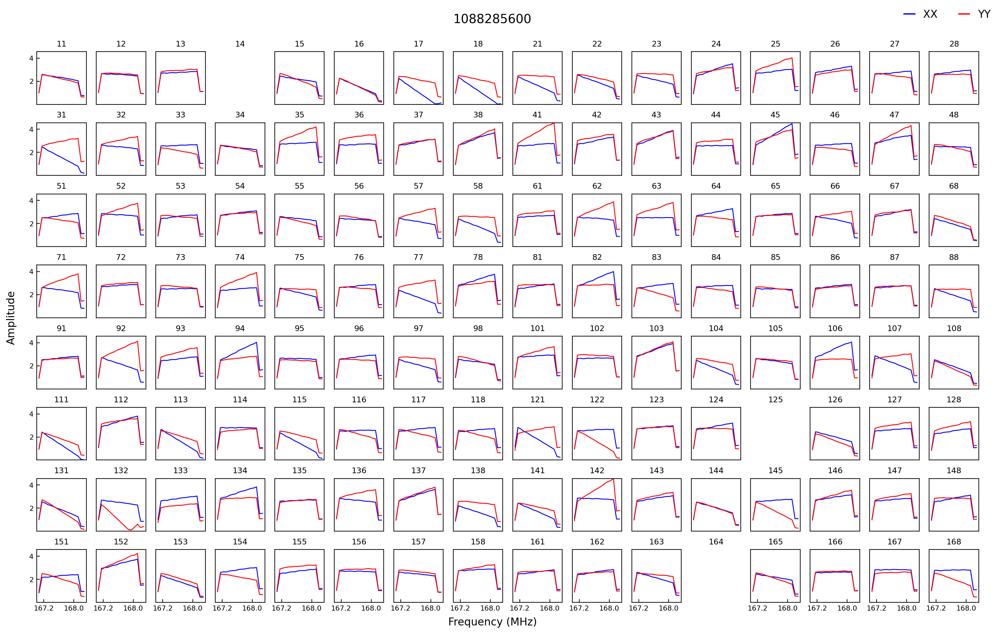
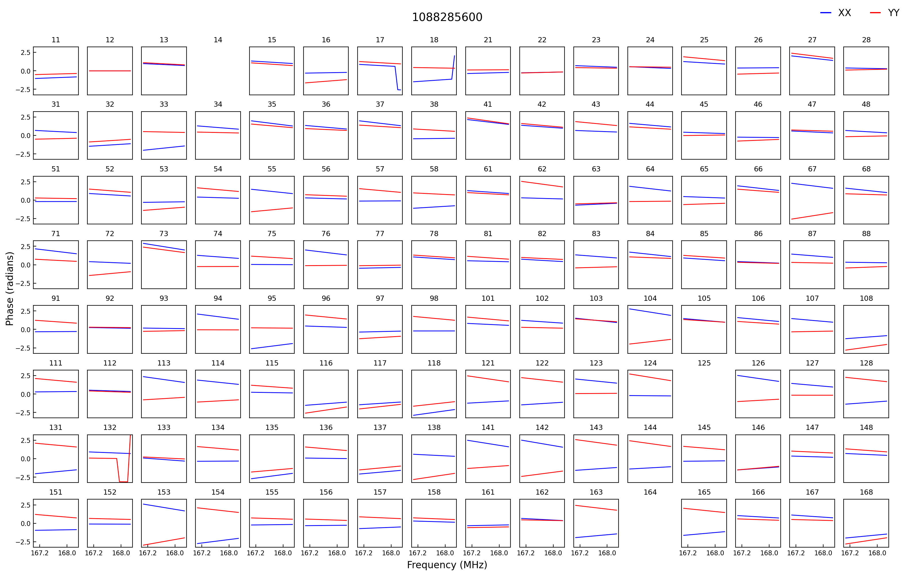
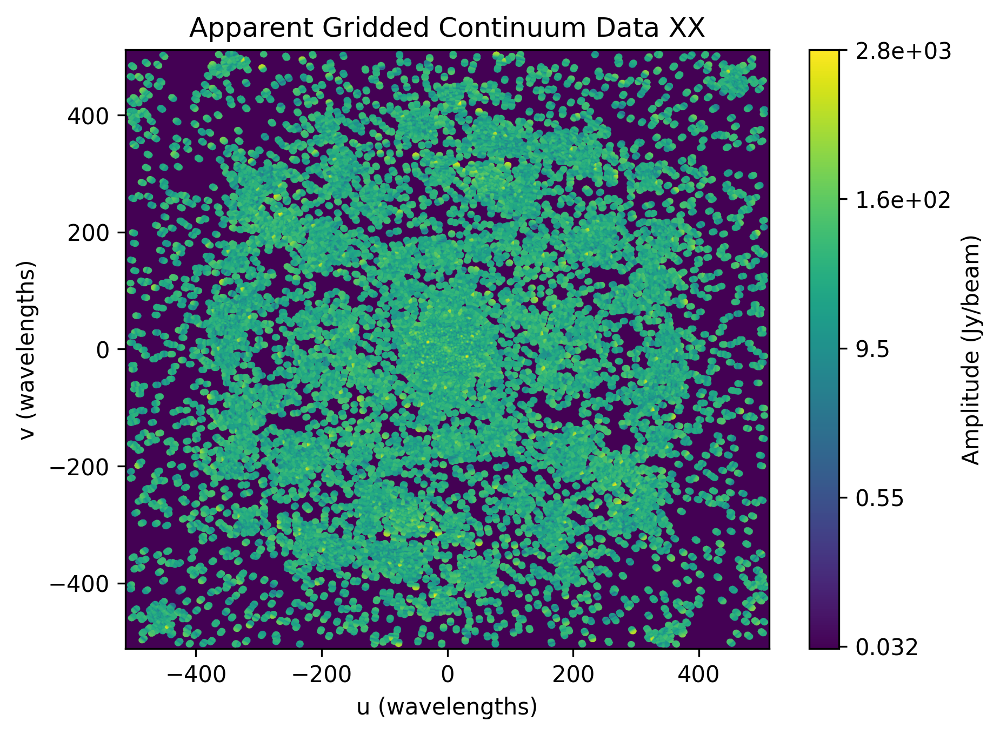
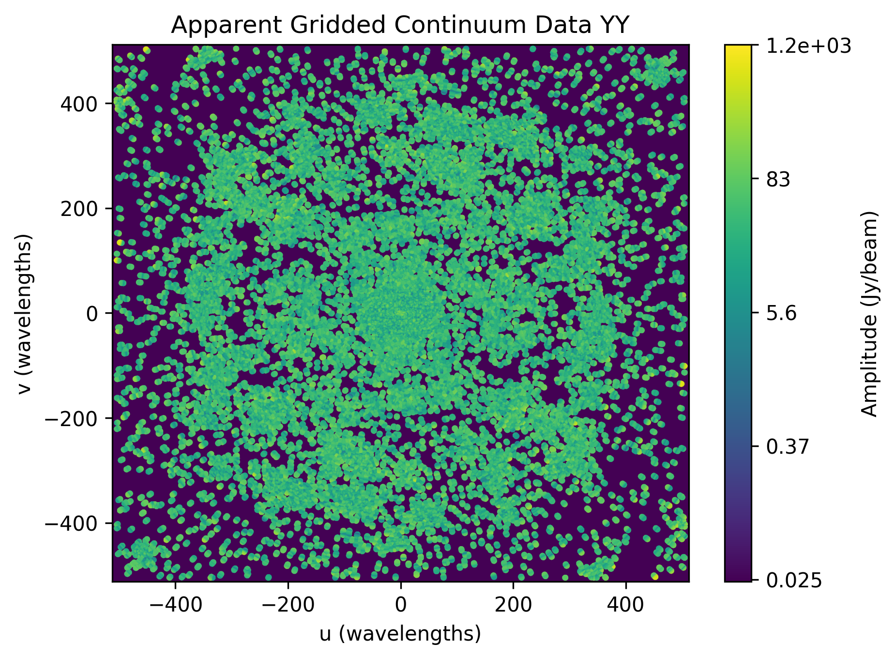
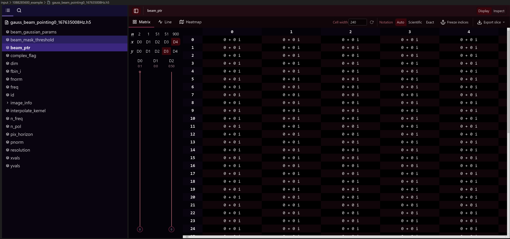

.. _WODEN: https://woden.readthedocs.io/en/latest/index.html
.. _FHD: https://github.com/EoRImaging/FHD
.. _pyuvdata: https://pyuvdata.readthedocs.io/en/latest/index.html
.. _pyradiosky: https://pyradiosky.readthedocs.io/en/latest/index.html

.. _tutorial:

Tutorial
=========

First make sure you have installed ``pyfhd`` following the instructions in the
:doc:`Installation Guide <../installation/installation>`.

Let's start with getting you off the ground and running using the sample data
built into ``pyfhd``. The example data is a small subset of the observation
``1088285600`` with a beam that uses only one frequency, and model visibilities
simulated using `WODEN`_. To run ``pyfhd`` we will use the command line interface
(CLI) that has been built to run ``pyfhd``.

.. _sample-data:

Initial Test Run
----------------

To run the example data, you'll need to get the sample data first, to do this run:

.. code-block:: bash

  pyfhd --get-sample-data 1088285600

Which will copy the sample data built into the pyfhd package to your current
working directory, inside a directory and sub-directory called ``input/1088285600_example``.

Running the sample data
+++++++++++++++++++++++

From there in that directory, you should be able to run the following command to
run the example data:

.. code-block:: bash

  pyfhd -c ./input/1088285600_example/1088285600_example.yaml 1088285600

The command on most machines takes 1-2 minutes to run, and the output is stored
in the ``output`` directory.

This will run the entire pyfhd pipeline in this order:

1. Setting up the run with logs and outputs

2. Extracting visibilities

3. Creating the observation metadata dictionary (and other metadata dictionaries)

4. Import the beam

5. Importing the model visibilities

6. Running calibration

7. Flagging

8. Gridding

9. Exporting the results

10. Generating HEALPIX fits and HEALPIX files (in HDF5 format)

11. Finishing the run and cleaning up

If the command runs successfully you should get a log to your terminal (stdout)
that looks something like this:

.. raw:: html

  

  
Sample Data pyfhd Collapsible Log

  

.. code-block:: text

  ooooooooo.               oooooooooooo ooooo   ooooo oooooooooo.
  8888   `Y88.             8888       8 8888    888   888     Y8b
  888   .d88' oooo    ooo  888          888     888   888      888
  888ooo88P'   `88.  .8'   888oooo8     888ooooo888   888      888
  888           `88..8'    888          888     888   888      888
  888            `888'     888          888     888   888     d88'
  o888o            .8'     o888o        o888o   o888o o888bood8P'
              .o..P'
              `Y8P'

  Python Fast Holographic Deconvolution

  Translated from IDL to Python as a collaboration between Astronomy Data and
  Computing Services (ADACS) and the Epoch of Reionisation (EoR) Team.

  Repository: https://github.com/EoRImaging/pyfhd

  Documentation: https://pyfhd.readthedocs.io/en/latest/

  Git Commit Hash: 467cb91bcba3f06cded5405f3ffcc9638bd13c26

  pyfhd Run Started At: Fri May 30 09:52:35 2025

  Observation ID: 1088285600

  Confifuration File: ./input/1088285600 example/1088285600 example.yaml

  Validating your input...

  2025-05-30 09:52:35 - INFO:
    Logging and configuration file created and copied to here: /home/skywatcher/projects/pyfhd/output/pyfhd_1088285600_example
  2025-05-30 09:52:35 - INFO:
    Input validated, starting pyfhd run now
  2025-05-30 09:52:35 - INFO:
    Reading in visibilities from: input/1088285600_example/1088285600.uvfits
  2025-05-30 09:52:35 - WARNING:
    OBSRA not found in UVFITS file
  2025-05-30 09:52:35 - WARNING:
    OBSDEC not found in UVFITS file
  2025-05-30 09:52:35 - INFO:
    Setting mwa instrument location to: lon 116.67, lat -26.70, alt 377.83
  2025-05-30 09:52:35 - INFO:
    pyfhd Header Created completed in: 44.74807 milliseconds
  2025-05-30 09:52:35 - INFO:
    Params Created completed in: 0.27895 milliseconds
  2025-05-30 09:52:35 - INFO:
    Visibilities Extracted completed in: 9.38296 milliseconds
  2025-05-30 09:52:35 - INFO:
    Writing the visibilities array to output/pyfhd_1088285600_example/visibilities/1088285600_raw_vis_arr.h5
  2025-05-30 09:52:35 - INFO:
    Writing the weights array to output/pyfhd_1088285600_example/visibilities/1088285600_raw_vis_weights.h5
  2025-05-30 09:52:35 - WARNING:
    Number of Leap Seconds is missing and the time system isn't IAT so we can't know the leap seconds, setting as -1
  2025-05-30 09:52:35 - WARNING:
    PolA params is missing from the UVFITS, set to array of zeros of length n_pol_cal_params or 0
  2025-05-30 09:52:35 - WARNING:
    PolB params is missing from the UVFITS, set to array of zeros of length n_pol_cal_params or 0
  2025-05-30 09:52:35 - INFO:
    Diameters not in UVFITS file continuing.
  2025-05-30 09:52:35 - INFO:
    Beam Full Width Half maximum not present in UVFITS continuing.
  2025-05-30 09:52:35 - INFO:
    Writing the layout dict to output/pyfhd_1088285600_example/layout.h5, each key will be a dataset, if the key contains a dict then it will be a group.
  2025-05-30 09:52:35 - INFO:
    Layout Dictionary Extracted completed in: 7.91407 milliseconds
  2025-05-30 09:52:38 - INFO:
    Obs Dictionary Created completed in: 2.92785 seconds
  2025-05-30 09:52:38 - INFO:
    Writing the obs_checkpoint dict to output/pyfhd_1088285600_example/checkpoints/1088285600_example_obs_checkpoint.h5, each key will be a dataset, if the key contains a dict then it will be a group.
  2025-05-30 09:52:39 - INFO:
    Checkpoint Saved: Uncalibrated visibility parameters, array and weights and the observation metadata dictionary saved into output/pyfhd_1088285600_example/obs_checkpoint.h5
  2025-05-30 09:52:39 - INFO:
    Reading in the HDF5 file input/1088285600_example/gauss_beam_pointing0_167635008Hz.h5
  2025-05-30 09:52:39 - INFO:
    Loading input/1088285600_example/gauss_beam_pointing0_167635008Hz.h5 into a dictionary
  2025-05-30 09:52:39 - INFO:
    Beam and PSF dictionary imported. completed in: 301.2073 milliseconds
  2025-05-30 09:52:39 - INFO:
    Basic Flagging Completed completed in: 2.48504 milliseconds
  2025-05-30 09:52:40 - INFO:
    Visibilities Weights Updated After Basic Flagging completed in: 1.17173 seconds
  2025-05-30 09:52:40 - INFO:
    Reading in model visibilities from: /home/skywatcher/projects/pyfhd/input/1088285600_example/1088285600_model.uvfits
  2025-05-30 09:52:40 - INFO:
    Setting mwa instrument location to: lon 116.67, lat -26.70, alt 377.83
  2025-05-30 09:52:40 - WARNING:
    Model time stamps are offset from data by an average of 1.0. Accounting for this to match model time steps to data
  2025-05-30 09:52:40 - INFO:
    Found flagged tiles [4, 124] in the data, flagging from the model
  2025-05-30 09:52:40 - INFO:
    Model Imported and Flagged From UVFITS completed in: 20.36548 milliseconds
  2025-05-30 09:52:40 - INFO:
    Beginning Calibration
  2025-05-30 09:52:40 - INFO:
    Gain initialized beginning vis_calibrate subroutine
  2025-05-30 09:52:40 - INFO:
    Beginning Calibration for polarization 0 (XX)
  2025-05-30 09:52:40 - INFO:
    Convergence was reached for polarization: XX (0) and frequency: 1, with a convergence of: 9.98593970029745e-08 and the threshold was: 1e-07
  2025-05-30 09:52:40 - INFO:
    Convergence was reached for polarization: XX (0) and frequency: 2, with a convergence of: 9.999992919655905e-08 and the threshold was: 1e-07
  2025-05-30 09:52:40 - INFO:
    Convergence was reached for polarization: XX (0) and frequency: 3, with a convergence of: 8.344520524730864e-08 and the threshold was: 1e-07
  2025-05-30 09:52:41 - INFO:
    Convergence was reached for polarization: XX (0) and frequency: 4, with a convergence of: 9.884876342819337e-08 and the threshold was: 1e-07
  2025-05-30 09:52:41 - INFO:
    Convergence was reached for polarization: XX (0) and frequency: 5, with a convergence of: 8.003533551747955e-08 and the threshold was: 1e-07
  2025-05-30 09:52:41 - INFO:
    Convergence was reached for polarization: XX (0) and frequency: 6, with a convergence of: 8.544033568047118e-08 and the threshold was: 1e-07
  2025-05-30 09:52:41 - INFO:
    Convergence was reached for polarization: XX (0) and frequency: 7, with a convergence of: 8.130504801062689e-08 and the threshold was: 1e-07
  2025-05-30 09:52:41 - INFO:
    Convergence was reached for polarization: XX (0) and frequency: 8, with a convergence of: 9.104656101282636e-08 and the threshold was: 1e-07
  2025-05-30 09:52:41 - INFO:
    Convergence was reached for polarization: XX (0) and frequency: 9, with a convergence of: 8.354614840674757e-08 and the threshold was: 1e-07
  2025-05-30 09:52:41 - INFO:
    Convergence was reached for polarization: XX (0) and frequency: 10, with a convergence of: 9.918106515438548e-08 and the threshold was: 1e-07
  2025-05-30 09:52:41 - INFO:
    Convergence was reached for polarization: XX (0) and frequency: 11, with a convergence of: 9.869434977124244e-08 and the threshold was: 1e-07
  2025-05-30 09:52:42 - INFO:
    Convergence was reached for polarization: XX (0) and frequency: 12, with a convergence of: 8.895645139753463e-08 and the threshold was: 1e-07
  2025-05-30 09:52:42 - INFO:
    Convergence was reached for polarization: XX (0) and frequency: 13, with a convergence of: 9.459813804237299e-08 and the threshold was: 1e-07
  2025-05-30 09:52:42 - INFO:
    Beginning Calibration for polarization 1 (YY)
  2025-05-30 09:52:42 - INFO:
    Convergence was reached for polarization: YY (1) and frequency: 1, with a convergence of: 8.583005611987811e-08 and the threshold was: 1e-07
  2025-05-30 09:52:42 - INFO:
    Convergence was reached for polarization: YY (1) and frequency: 2, with a convergence of: 8.466878902748548e-08 and the threshold was: 1e-07
  2025-05-30 09:52:42 - INFO:
    Convergence was reached for polarization: YY (1) and frequency: 3, with a convergence of: 9.921026305432663e-08 and the threshold was: 1e-07
  2025-05-30 09:52:42 - INFO:
    Convergence was reached for polarization: YY (1) and frequency: 4, with a convergence of: 8.426838709848088e-08 and the threshold was: 1e-07
  2025-05-30 09:52:42 - INFO:
    Convergence was reached for polarization: YY (1) and frequency: 5, with a convergence of: 8.969077306790065e-08 and the threshold was: 1e-07
  2025-05-30 09:52:42 - INFO:
    Convergence was reached for polarization: YY (1) and frequency: 6, with a convergence of: 9.584932160621179e-08 and the threshold was: 1e-07
  2025-05-30 09:52:43 - INFO:
    Convergence was reached for polarization: YY (1) and frequency: 7, with a convergence of: 9.976283744227554e-08 and the threshold was: 1e-07
  2025-05-30 09:52:43 - INFO:
    Convergence was reached for polarization: YY (1) and frequency: 8, with a convergence of: 9.165962316245378e-08 and the threshold was: 1e-07
  2025-05-30 09:52:43 - INFO:
    Convergence was reached for polarization: YY (1) and frequency: 9, with a convergence of: 8.711660483214532e-08 and the threshold was: 1e-07
  2025-05-30 09:52:43 - INFO:
    Convergence was reached for polarization: YY (1) and frequency: 10, with a convergence of: 8.482012447714498e-08 and the threshold was: 1e-07
  2025-05-30 09:52:43 - INFO:
    Convergence was reached for polarization: YY (1) and frequency: 11, with a convergence of: 8.962296769672843e-08 and the threshold was: 1e-07
  2025-05-30 09:52:43 - INFO:
    Convergence was reached for polarization: YY (1) and frequency: 12, with a convergence of: 8.715709933918354e-08 and the threshold was: 1e-07
  2025-05-30 09:52:43 - INFO:
    Convergence was reached for polarization: YY (1) and frequency: 13, with a convergence of: 8.780971269246983e-08 and the threshold was: 1e-07
  2025-05-30 09:52:43 - INFO:
    Function vis_calibrate_subroutine has completed.
  2025-05-30 09:52:43 - INFO:
    Flagging Calibration has been activated and calibration will now be flagged
  2025-05-30 09:52:43 - INFO:
    You have chosen to perform a bandpass calculation and calibration
  2025-05-30 09:52:43 - WARNING:
    /home/skywatcher/projects/pyfhd/src/pyfhd/pyfhd_tools/pyfhd_utils.py:709: RuntimeWarning: overflow encountered in divide
    result[i_use] = 1 / weights[i_use]

  2025-05-30 09:52:43 - INFO:
    You have selected to perform polynomial fits over the frequency band
  2025-05-30 09:52:44 - INFO:
    Applying the calibration
  2025-05-30 09:52:44 - INFO:
    Saving the ratio and sigma average variance
  2025-05-30 09:52:44 - INFO:
    Calculating statistics from calibration
  2025-05-30 09:52:44 - INFO:
    Plotting the calibration solutions into output/pyfhd_1088285600_example/plots/calibration
  2025-05-30 09:52:55 - INFO:
    Visibilities calibrated and cal dictionary with gains created completed in: 15.02258 seconds
  2025-05-30 09:52:55 - INFO:
    Visibilities Weights Updated After Calibration completed in: 50.36974 milliseconds
  2025-05-30 09:52:55 - INFO:
    Noise Calculated and added to obs completed in: 7.34496 milliseconds
  2025-05-30 09:52:55 - INFO:
    Writing the calibrate_checkpoint dict to output/pyfhd_1088285600_example/checkpoints/1088285600_example_calibrate_checkpoint.h5, each key will be a dataset, if the key contains a dict then it will be a group.
  2025-05-30 09:52:56 - INFO:
    Checkpoint Saved: Calibrated and Flagged visibility parameters, array and weights, the flagged observation metadata dictionary and the calibration dictionary saved into output/pyfhd_1088285600_example/calibrate_checkpoint.h5
  2025-05-30 09:52:56 - INFO:
    Gridding has begun for polarization XX
  2025-05-30 09:52:57 - INFO:
    Gridding  visibilities for baseline 2782 of 27825 for polarization XX
  2025-05-30 09:52:57 - INFO:
    Gridding  visibilities for baseline 5564 of 27825 for polarization XX
  2025-05-30 09:52:58 - INFO:
    Gridding  visibilities for baseline 8346 of 27825 for polarization XX
  2025-05-30 09:52:59 - INFO:
    Gridding  visibilities for baseline 11128 of 27825 for polarization XX
  2025-05-30 09:52:59 - INFO:
    Gridding  visibilities for baseline 13910 of 27825 for polarization XX
  2025-05-30 09:53:00 - INFO:
    Gridding  visibilities for baseline 16692 of 27825 for polarization XX
  2025-05-30 09:53:01 - INFO:
    Gridding  visibilities for baseline 19474 of 27825 for polarization XX
  2025-05-30 09:53:02 - INFO:
    Gridding  visibilities for baseline 22256 of 27825 for polarization XX
  2025-05-30 09:53:03 - INFO:
    Gridding  visibilities for baseline 25038 of 27825 for polarization XX
  2025-05-30 09:53:04 - INFO:
    Gridding  visibilities for baseline 27820 of 27825 for polarization XX
  2025-05-30 09:53:04 - INFO:
    Gridding has finished for polarization XX
  2025-05-30 09:53:04 - INFO:
    Gridding has begun for polarization YY
  2025-05-30 09:53:05 - INFO:
    Gridding  visibilities for baseline 2782 of 27825 for polarization YY
  2025-05-30 09:53:06 - INFO:
    Gridding  visibilities for baseline 5564 of 27825 for polarization YY
  2025-05-30 09:53:06 - INFO:
    Gridding  visibilities for baseline 8346 of 27825 for polarization YY
  2025-05-30 09:53:07 - INFO:
    Gridding  visibilities for baseline 11128 of 27825 for polarization YY
  2025-05-30 09:53:08 - INFO:
    Gridding  visibilities for baseline 13910 of 27825 for polarization YY
  2025-05-30 09:53:08 - INFO:
    Gridding  visibilities for baseline 16692 of 27825 for polarization YY
  2025-05-30 09:53:09 - INFO:
    Gridding  visibilities for baseline 19474 of 27825 for polarization YY
  2025-05-30 09:53:10 - INFO:
    Gridding  visibilities for baseline 22256 of 27825 for polarization YY
  2025-05-30 09:53:11 - INFO:
    Gridding  visibilities for baseline 25038 of 27825 for polarization YY
  2025-05-30 09:53:13 - INFO:
    Gridding  visibilities for baseline 27820 of 27825 for polarization YY
  2025-05-30 09:53:13 - INFO:
    Gridding has finished for polarization YY
  2025-05-30 09:53:13 - INFO:
    Plotting the continuum gridding outputs into output/pyfhd_1088285600_example/plots/gridding
  2025-05-30 09:53:19 - INFO:
    Writing the gridding_checkpoint dict to output/pyfhd_1088285600_example/checkpoints/1088285600_example_gridding_checkpoint.h5, each key will be a dataset, if the key contains a dict then it will be a group.
  2025-05-30 09:53:25 - INFO:
    Checkpoint Saved: The Gridded UV Planes saved into output/pyfhd_1088285600_example/gridding_checkpoint.h5
  2025-05-30 09:53:25 - INFO:
    Visibilities gridded completed in: 29.42883 seconds
  2025-05-30 09:53:25 - INFO:
    Saving the obs dictionary to output/pyfhd_1088285600_example/metadata/1088285600_obs.h5
  2025-05-30 09:53:25 - INFO:
    Writing the obs dict to output/pyfhd_1088285600_example/metadata/1088285600_obs.h5, each key will be a dataset, if the key contains a dict then it will be a group.
  2025-05-30 09:53:25 - INFO:
    Saving params dictionary to output/pyfhd_1088285600_example/metadata/1088285600_params.h5
  2025-05-30 09:53:25 - INFO:
    Writing the params dict to output/pyfhd_1088285600_example/metadata/1088285600_params.h5, each key will be a dataset, if the key contains a dict then it will be a group.
  2025-05-30 09:53:25 - INFO:
    Saving the gridded uv planes to output/pyfhd_1088285600_example/gridding
  2025-05-30 09:53:25 - INFO:
    Writing the image_uv array to output/pyfhd_1088285600_example/gridding/1088285600_image_uv.h5
  2025-05-30 09:53:27 - INFO:
    Writing the weights_uv array to output/pyfhd_1088285600_example/gridding/1088285600_weights_uv.h5
  2025-05-30 09:53:28 - INFO:
    Writing the variance_uv array to output/pyfhd_1088285600_example/gridding/1088285600_variance_uv.h5
  2025-05-30 09:53:29 - INFO:
    Writing the uniform_filter_uv array to output/pyfhd_1088285600_example/gridding/1088285600_uniform_filter_uv.h5
  2025-05-30 09:53:29 - INFO:
    Writing the model_uv array to output/pyfhd_1088285600_example/gridding/1088285600_model_uv.h5
  2025-05-30 09:53:31 - INFO:
    Saving the calibrated visibilities to output/pyfhd_1088285600_example/visibilities/1088285600_calibrated_vis_arr.h5
  2025-05-30 09:53:31 - INFO:
    Writing the visibilities array to output/pyfhd_1088285600_example/visibilities/1088285600_calibrated_vis_arr.h5
  2025-05-30 09:53:31 - INFO:
    Saving the calibration dictionary to output/pyfhd_1088285600_example/calibration/1088285600_cal.h5
  2025-05-30 09:53:31 - INFO:
    Writing the cal dict to output/pyfhd_1088285600_example/calibration/1088285600_cal.h5, each key will be a dataset, if the key contains a dict then it will be a group.
  2025-05-30 09:53:31 - INFO:
    Saving the calibrated weights to output/pyfhd_1088285600_example/visibilities/1088285600_calibrated_vis_weights.h5
  2025-05-30 09:53:31 - INFO:
    Writing the weights array to output/pyfhd_1088285600_example/visibilities/1088285600_calibrated_vis_weights.h5
  2025-05-30 09:53:34 - INFO:
    Using filter_uv_uniform for dirty_image_generate
  2025-05-30 09:53:34 - INFO:
    Using filter_uv_uniform for dirty_image_generate
  2025-05-30 09:53:36 - INFO:
    Building the FITS Header for all the FITS files
  2025-05-30 09:53:36 - INFO:
    Saving the FITS files for polarization XX
  2025-05-30 09:53:36 - INFO:
    Plotting the continuum images for polarization XX into output/pyfhd_1088285600_example/plots/images
  2025-05-30 09:53:36 - WARNING:
    /home/skywatcher/projects/pyfhd/.venv/lib/python3.13/site-packages/astropy/wcs/wcs.py:537: FITSFixedWarning: RADECSYS= 'ICRS ' / Reference Frame
  the RADECSYS keyword is deprecated, use RADESYSa.
    wcsprm = _wcs.Wcsprm(

  2025-05-30 09:53:37 - WARNING:
    /home/skywatcher/projects/pyfhd/.venv/lib/python3.13/site-packages/astropy/wcs/wcs.py:537: FITSFixedWarning: RADECSYS= 'ICRS ' / Reference Frame
  the RADECSYS keyword is deprecated, use RADESYSa.
    wcsprm = _wcs.Wcsprm(

  2025-05-30 09:53:38 - WARNING:
    /home/skywatcher/projects/pyfhd/.venv/lib/python3.13/site-packages/astropy/wcs/wcs.py:537: FITSFixedWarning: RADECSYS= 'ICRS ' / Reference Frame
  the RADECSYS keyword is deprecated, use RADESYSa.
    wcsprm = _wcs.Wcsprm(

  2025-05-30 09:53:38 - WARNING:
    /home/skywatcher/projects/pyfhd/.venv/lib/python3.13/site-packages/astropy/wcs/wcs.py:537: FITSFixedWarning: RADECSYS= 'ICRS ' / Reference Frame
  the RADECSYS keyword is deprecated, use RADESYSa.
    wcsprm = _wcs.Wcsprm(

  2025-05-30 09:53:39 - WARNING:
    FITS data must be a 2D array, no image made for output/pyfhd_1088285600_example/fits/1088285600_uv_weights_XX.fits.
  2025-05-30 09:53:39 - INFO:
    Saving the FITS files for polarization YY
  2025-05-30 09:53:39 - INFO:
    Plotting the continuum images for polarization YY into output/pyfhd_1088285600_example/plots/images
  2025-05-30 09:53:39 - WARNING:
    /home/skywatcher/projects/pyfhd/.venv/lib/python3.13/site-packages/astropy/wcs/wcs.py:537: FITSFixedWarning: RADECSYS= 'ICRS ' / Reference Frame
  the RADECSYS keyword is deprecated, use RADESYSa.
    wcsprm = _wcs.Wcsprm(

  2025-05-30 09:53:40 - WARNING:
    /home/skywatcher/projects/pyfhd/.venv/lib/python3.13/site-packages/astropy/wcs/wcs.py:537: FITSFixedWarning: RADECSYS= 'ICRS ' / Reference Frame
  the RADECSYS keyword is deprecated, use RADESYSa.
    wcsprm = _wcs.Wcsprm(

  2025-05-30 09:53:41 - WARNING:
    /home/skywatcher/projects/pyfhd/.venv/lib/python3.13/site-packages/astropy/wcs/wcs.py:537: FITSFixedWarning: RADECSYS= 'ICRS ' / Reference Frame
  the RADECSYS keyword is deprecated, use RADESYSa.
    wcsprm = _wcs.Wcsprm(

  2025-05-30 09:53:42 - WARNING:
    /home/skywatcher/projects/pyfhd/.venv/lib/python3.13/site-packages/astropy/wcs/wcs.py:537: FITSFixedWarning: RADECSYS= 'ICRS ' / Reference Frame
  the RADECSYS keyword is deprecated, use RADESYSa.
    wcsprm = _wcs.Wcsprm(

  2025-05-30 09:53:43 - WARNING:
    FITS data must be a 2D array, no image made for output/pyfhd_1088285600_example/fits/1088285600_uv_weights_YY.fits.
  2025-05-30 09:53:43 - INFO:
    Loading /home/skywatcher/projects/pyfhd/src/pyfhd/templates/EoR0_high_healpix_inds.h5 into a dictionary
  2025-05-30 09:53:44 - WARNING:
    All data flagged or cut!
  2025-05-30 09:53:44 - ERROR:
    All data has been flagged
  2025-05-30 09:53:44 - WARNING:
    No visibilities gridded for frequency channel [14 15] and polarization XX (0)
  2025-05-30 09:53:44 - INFO:
    Writing the 1088285600_even_XX_dirty_uv_arr_gridded_uvf.h5 dict to output/pyfhd_1088285600_example/healpix/uvf_grid/1088285600_even_XX_dirty_uv_arr_gridded_uvf.h5, each key will be a dataset, if the key contains a dict then it will be a group.
  2025-05-30 09:53:45 - INFO:
    Writing the 1088285600_even_XX_weights_uv_gridded_uvf.h5 dict to output/pyfhd_1088285600_example/healpix/uvf_grid/1088285600_even_XX_weights_uv_gridded_uvf.h5, each key will be a dataset, if the key contains a dict then it will be a group.
  2025-05-30 09:53:46 - INFO:
    Writing the 1088285600_even_XX_variance_uv_arr_gridded_uvf.h5 dict to output/pyfhd_1088285600_example/healpix/uvf_grid/1088285600_even_XX_variance_uv_arr_gridded_uvf.h5, each key will be a dataset, if the key contains a dict then it will be a group.
  2025-05-30 09:53:47 - INFO:
    Writing the 1088285600_even_XX_model_uv_arr_gridded_uvf.h5 dict to output/pyfhd_1088285600_example/healpix/uvf_grid/1088285600_even_XX_model_uv_arr_gridded_uvf.h5, each key will be a dataset, if the key contains a dict then it will be a group.
  2025-05-30 09:53:49 - INFO:
    Writing the 1088285600_hpx_even_XX dict to output/pyfhd_1088285600_example/healpix/1088285600_hpx_even_XX.h5, each key will be a dataset, if the key contains a dict then it will be a group.
  2025-05-30 09:53:51 - WARNING:
    All data flagged or cut!
  2025-05-30 09:53:51 - ERROR:
    All data has been flagged
  2025-05-30 09:53:51 - WARNING:
    No visibilities gridded for frequency channel [14 15] and polarization YY (1)
  2025-05-30 09:53:51 - INFO:
    Writing the 1088285600_even_YY_dirty_uv_arr_gridded_uvf.h5 dict to output/pyfhd_1088285600_example/healpix/uvf_grid/1088285600_even_YY_dirty_uv_arr_gridded_uvf.h5, each key will be a dataset, if the key contains a dict then it will be a group.
  2025-05-30 09:53:52 - INFO:
    Writing the 1088285600_even_YY_weights_uv_gridded_uvf.h5 dict to output/pyfhd_1088285600_example/healpix/uvf_grid/1088285600_even_YY_weights_uv_gridded_uvf.h5, each key will be a dataset, if the key contains a dict then it will be a group.
  2025-05-30 09:53:53 - INFO:
    Writing the 1088285600_even_YY_variance_uv_arr_gridded_uvf.h5 dict to output/pyfhd_1088285600_example/healpix/uvf_grid/1088285600_even_YY_variance_uv_arr_gridded_uvf.h5, each key will be a dataset, if the key contains a dict then it will be a group.
  2025-05-30 09:53:54 - INFO:
    Writing the 1088285600_even_YY_model_uv_arr_gridded_uvf.h5 dict to output/pyfhd_1088285600_example/healpix/uvf_grid/1088285600_even_YY_model_uv_arr_gridded_uvf.h5, each key will be a dataset, if the key contains a dict then it will be a group.
  2025-05-30 09:53:55 - INFO:
    Writing the 1088285600_hpx_even_YY dict to output/pyfhd_1088285600_example/healpix/1088285600_hpx_even_YY.h5, each key will be a dataset, if the key contains a dict then it will be a group.
  2025-05-30 09:53:57 - WARNING:
    All data flagged or cut!
  2025-05-30 09:53:57 - ERROR:
    All data has been flagged
  2025-05-30 09:53:57 - WARNING:
    No visibilities gridded for frequency channel [14 15] and polarization XX (0)
  2025-05-30 09:53:57 - INFO:
    Writing the 1088285600_odd_XX_dirty_uv_arr_gridded_uvf.h5 dict to output/pyfhd_1088285600_example/healpix/uvf_grid/1088285600_odd_XX_dirty_uv_arr_gridded_uvf.h5, each key will be a dataset, if the key contains a dict then it will be a group.
  2025-05-30 09:53:58 - INFO:
    Writing the 1088285600_odd_XX_weights_uv_gridded_uvf.h5 dict to output/pyfhd_1088285600_example/healpix/uvf_grid/1088285600_odd_XX_weights_uv_gridded_uvf.h5, each key will be a dataset, if the key contains a dict then it will be a group.
  2025-05-30 09:53:59 - INFO:
    Writing the 1088285600_odd_XX_variance_uv_arr_gridded_uvf.h5 dict to output/pyfhd_1088285600_example/healpix/uvf_grid/1088285600_odd_XX_variance_uv_arr_gridded_uvf.h5, each key will be a dataset, if the key contains a dict then it will be a group.
  2025-05-30 09:54:00 - INFO:
    Writing the 1088285600_odd_XX_model_uv_arr_gridded_uvf.h5 dict to output/pyfhd_1088285600_example/healpix/uvf_grid/1088285600_odd_XX_model_uv_arr_gridded_uvf.h5, each key will be a dataset, if the key contains a dict then it will be a group.
  2025-05-30 09:54:02 - INFO:
    Writing the 1088285600_hpx_odd_XX dict to output/pyfhd_1088285600_example/healpix/1088285600_hpx_odd_XX.h5, each key will be a dataset, if the key contains a dict then it will be a group.
  2025-05-30 09:54:04 - WARNING:
    All data flagged or cut!
  2025-05-30 09:54:04 - ERROR:
    All data has been flagged
  2025-05-30 09:54:04 - WARNING:
    No visibilities gridded for frequency channel [14 15] and polarization YY (1)
  2025-05-30 09:54:04 - INFO:
    Writing the 1088285600_odd_YY_dirty_uv_arr_gridded_uvf.h5 dict to output/pyfhd_1088285600_example/healpix/uvf_grid/1088285600_odd_YY_dirty_uv_arr_gridded_uvf.h5, each key will be a dataset, if the key contains a dict then it will be a group.
  2025-05-30 09:54:05 - INFO:
    Writing the 1088285600_odd_YY_weights_uv_gridded_uvf.h5 dict to output/pyfhd_1088285600_example/healpix/uvf_grid/1088285600_odd_YY_weights_uv_gridded_uvf.h5, each key will be a dataset, if the key contains a dict then it will be a group.
  2025-05-30 09:54:06 - INFO:
    Writing the 1088285600_odd_YY_variance_uv_arr_gridded_uvf.h5 dict to output/pyfhd_1088285600_example/healpix/uvf_grid/1088285600_odd_YY_variance_uv_arr_gridded_uvf.h5, each key will be a dataset, if the key contains a dict then it will be a group.
  2025-05-30 09:54:07 - INFO:
    Writing the 1088285600_odd_YY_model_uv_arr_gridded_uvf.h5 dict to output/pyfhd_1088285600_example/healpix/uvf_grid/1088285600_odd_YY_model_uv_arr_gridded_uvf.h5, each key will be a dataset, if the key contains a dict then it will be a group.
  2025-05-30 09:54:08 - INFO:
    Writing the 1088285600_hpx_odd_YY dict to output/pyfhd_1088285600_example/healpix/1088285600_hpx_odd_YY.h5, each key will be a dataset, if the key contains a dict then it will be a group.
  2025-05-30 09:54:09 - INFO:
    Writing the pyfhd_config dict to output/pyfhd_1088285600_example/config/pyfhd_config.h5, each key will be a dataset, if the key contains a dict then it will be a group.
  2025-05-30 09:54:09 - INFO:
    pyfhd Run Completed for 1088285600
  Total Runtime (Days:Hours:Minutes:Seconds.Millseconds): 0:01:33.849671

.. raw:: html

  

  

Take note of the line:

.. code-block:: text

  Logging and configuration file created and copied to here: <your current working directory>/output/pyfhd_1088285600_example

More details about the output of the pyfhd pipeline and the required inputs is
clarified in the next section.

.. important::
  The configuration used for the sample is very different to a full MWA run due
  to limited use of frequencies and times used in the sample data to keep it small.
  For a better template to base your configuration on see the next section.

Running ``pyfhd``
-----------------

To run ``pyfhd``, you must provide observation ID and a yaml config file. You can
see a default configuration file
`here <https://raw.githubusercontent.com/EoRImaging/pyfhd/refs/heads/main/pyfhd/resources/config/pyfhd.yaml>`_.
We suggest copying it and making the appropriate changes to reflect your directory
structure and dataset. There are many options (and more are being added frequently),
some of the most common ones are discussed in later sections of this tutorial.
All the options can be seen at our :doc:`API documentation page <../documentation/documentation>`.
Some validation is performed before and during runtime of ``pyfhd`` to check for
incompatibilities though it is not exhaustive.

.. note::
  Note that to provide a ``None`` input in the yaml you must use ``~`` or ``null``
  as those are translated to ``None`` when yamls are read into python.

The yaml config unifies all the settings for pyfhd. Most of the options come from
`FHD`_ (detailed in the `dictionary.md <https://github.com/EoRImaging/FHD/blob/master/dictionary.md>`_),
however some of the options are new and specific to ``pyfhd``. Some have been
renamed from `FHD`_ and, in the case of being renamed, the old name is referenced
inside the help text of the option.

Most of the options are numbers, lists of numbers, strings, or list of strings,
however some of the options are booleans. These booleans will have at minimum
two arguments that target the one option, one is the option itself, for example,
``--silent`` which when used will set the ``silent`` option to ``True``, and
``--no-silent`` which when used will set the ``silent`` option to ``False``.
All boolean options have the ``no-`` prefix available to you, in case you wish
to temporarily negate the options set in the configuration file via the command line.

You can adjust the configuration of ``pyfhd`` at run time by using command line
arguments like ``--calibrate-checkpoint`` to override what is set in the yaml
config file (these changes will be captured in the final yaml file described below).

.. tip::

  The hierarchy of the configuration in pyfhd is as follows:

  .. code-block::

         Code
          ⬇️
      Command Line
          ⬇️
         YAML

  The command line argument will override the YAML file, and the code will
  override the command line argument in certain situations. In situations where
  the code overrides the command line or YAML, ideally, a warning should be
  triggered or some error should be found. If no warning is logged when the
  code overrides the YAML or command line options, either add the warning to
  the code yourself and do a Pull request or open an issue on the repository.

``pyfhd`` outputs
+++++++++++++++++

``pyfhd`` writes out many files, all stored in one directory with the name set
by the ``--description`` option with ``pyfhd_`` prepended. If you don't set the
``--description`` option, the output directory name will be
``pyfhd_YYYY_MM_DD_HH_mm_ss`` using the time of the run. This is usually
undesireable because if you need to re-run anything it will start over in another
directory. In the example run above we set ``--description: "1088285600_example"``
so the output directory generated will be ``pyfhd_1088285600_example``.
The path where the output directory will be generated is ``--output-path``
(by default ``.`` meaning the working directory), assuming you're looking at the
example run above (which set ``--output-path:  "./output"``), the output directory
structure will look like this:

.. code-block:: bash

  output
  └── pyfhd_1088285600_example
      ├── beams
      │   └── 1088285600_beam.h5
      ├── calibration
      │   └── 1088285600_cal.h5
      ├── checkpoints
      │   ├── 1088285600_example_calibrate_checkpoint.h5
      │   ├── 1088285600_example_gridding_checkpoint.h5
      │   └── 1088285600_example_obs_checkpoint.h5
      ├── config
      │   ├── pyfhd_1088285600_example_2025_05_30_09_52_35-final.yaml
      │   ├── pyfhd_1088285600_example_2025_05_30_09_52_35.yaml
      │   └── pyfhd_config.h5
      ├── fits
      │   ├── 1088285600_beam_XX.fits
      │   ├── 1088285600_beam_YY.fits
      │   ├── 1088285600_uniform_dirty_XX.fits
      │   ├── 1088285600_uniform_dirty_YY.fits
      │   ├── 1088285600_uniform_model_XX.fits
      │   ├── 1088285600_uniform_model_YY.fits
      │   ├── 1088285600_uniform_residual_XX.fits
      │   ├── 1088285600_uniform_residual_YY.fits
      │   ├── 1088285600_uv_weights_XX.fits
      │   └── 1088285600_uv_weights_YY.fits
      ├── gridding
      │   ├── 1088285600_image_uv.h5
      │   ├── 1088285600_model_uv.h5
      │   ├── 1088285600_uniform_filter_uv.h5
      │   ├── 1088285600_variance_uv.h5
      │   └── 1088285600_weights_uv.h5
      ├── healpix
      │   ├── 1088285600_hpx_even_XX.h5
      │   ├── 1088285600_hpx_even_YY.h5
      │   ├── 1088285600_hpx_odd_XX.h5
      │   ├── 1088285600_hpx_odd_YY.h5
      │   └── uvf_grid
      │       ├── 1088285600_even_XX_dirty_uv_arr_gridded_uvf.h5
      │       ├── 1088285600_even_XX_model_uv_arr_gridded_uvf.h5
      │       ├── 1088285600_even_XX_variance_uv_arr_gridded_uvf.h5
      │       ├── 1088285600_even_XX_weights_uv_gridded_uvf.h5
      │       ├── 1088285600_even_YY_dirty_uv_arr_gridded_uvf.h5
      │       ├── 1088285600_even_YY_model_uv_arr_gridded_uvf.h5
      │       ├── 1088285600_even_YY_variance_uv_arr_gridded_uvf.h5
      │       ├── 1088285600_even_YY_weights_uv_gridded_uvf.h5
      │       ├── 1088285600_odd_XX_dirty_uv_arr_gridded_uvf.h5
      │       ├── 1088285600_odd_XX_model_uv_arr_gridded_uvf.h5
      │       ├── 1088285600_odd_XX_variance_uv_arr_gridded_uvf.h5
      │       ├── 1088285600_odd_XX_weights_uv_gridded_uvf.h5
      │       ├── 1088285600_odd_YY_dirty_uv_arr_gridded_uvf.h5
      │       ├── 1088285600_odd_YY_model_uv_arr_gridded_uvf.h5
      │       ├── 1088285600_odd_YY_variance_uv_arr_gridded_uvf.h5
      │       └── 1088285600_odd_YY_weights_uv_gridded_uvf.h5
      ├── layout.h5
      ├── metadata
      │   ├── 1088285600_obs.h5
      │   └── 1088285600_params.h5
      ├── plots
      │   ├── calibration
      │   │   ├── 1088285600_cal_amp.png
      │   │   ├── 1088285600_cal_phase.png
      │   │   ├── 1088285600_cal_raw_amp.png
      │   │   ├── 1088285600_cal_raw_phase.png
      │   │   ├── 1088285600_cal_residual_amp.png
      │   │   └── 1088285600_cal_residual_phase.png
      │   ├── gridding
      │   │   ├── 1088285600_grid_apparent_image_XX.png
      │   │   ├── 1088285600_grid_apparent_image_YY.png
      │   │   ├── 1088285600_grid_apparent_model_XX.png
      │   │   ├── 1088285600_grid_apparent_model_YY.png
      │   │   ├── 1088285600_grid_variance_XX.png
      │   │   └── 1088285600_grid_variance_YY.png
      │   └── images
      │       ├── 1088285600_beam_XX.png
      │       ├── 1088285600_beam_YY.png
      │       ├── 1088285600_uniform_dirty_XX.png
      │       ├── 1088285600_uniform_dirty_YY.png
      │       ├── 1088285600_uniform_model_XX.png
      │       ├── 1088285600_uniform_model_YY.png
      │       ├── 1088285600_uniform_residual_XX.png
      │       └── 1088285600_uniform_residual_YY.png
      ├── pyfhd_1088285600_example_2025_05_30_09_52_35.log
      └── visibilities
          ├── 1088285600_calibrated_vis_arr.h5
          ├── 1088285600_calibrated_vis_weights.h5
          ├── 1088285600_raw_vis_arr.h5
          └── 1088285600_raw_vis_weights.h5

The difference between the final and non-final yaml is that the final yaml is
generated at the end of the run so you can observe any changes made to
``pyfhd_config``, the config is also saved as a HDF5 file at the end of the run.
Changes may happen if you override anything on the command line when you call pyfhd
or due to defaults being set by pyfhd when you passed a None (``~`` in the yaml),
or due to minor conflicts in the options of your configuration file. Major conflicts
will raise errors, but minor conflicts will lead to warnings in the log file and
config changes that you will see in the final yaml.

The ``plots`` directory stores all the plots generated by ``pyfhd``, with
subdirectories for plots generated for each part of the pipeline. As a developer,
please maintain and expand this structure as appropriate.

Beams
-----
There are several choices for how to set up a beam in ``pyfhd``, beams are
required for gridding and de-gridding (making model visibilities).

The most common approach is to use the ``UVBeam`` object from `pyuvdata`_ to read
in a beam ``Jones`` matrix and decompose it into the terms needed for FHD.
To use this option, pass the beam file location using the ``uvbeam-file-path``
configuration option. If you are using this option, you can also use the
``uvbeam-freq-buffer`` to specify a buffer in Hz around the data frequency range
to use when reading in the beam. It should be set to at least twice the frequency
resolution of the beam (e.g. ``2e6`` is a reasonable value for the MWA beam,
which has 1 MHz resolution). Setting the buffer too small can result in
interpolation errors. If you do not set ``uvbeam-freq-buffer``, the full beam
file will be read in, which can increase the memory usage.

You can also use analytic beams that are sub-classes of the `pyuvdata`_
``AnalyticBeam`` object (a number are built into pyuvdata, but the infrastructure
is extensible and writing your own analytic beam is straight forward).
Note that analytic beams are currently sampled in image space and then Fourier
Transformed to uv space in pyfhd. They are not used as analytic functions in uv space.
To use this option, you must pass a yaml string enclosed in quotations to the
``analytic-beam-yaml`` configuration option. Details on how to compose these
yaml strings are in the `pyuvdata`_ documentation, but generally you must include
the analytic beam class and any required parameters to initialize the beam.

The approach used in the sample tutorial data is to use a beam that is saved out
of FHD (you can also used one save out of a prior pyfhd run). To use this option,
pass the beam file location using the ``saved-beam-file-path`` configuration option.

Currently, pyfhd does not support using different beams for different antennas,
but that functionality can be added (it exists in FHD).

You may run into memory limitations with your machine during testing, you can
decrease memory use by setting ``beam-nfreq-avg`` to larger values
(as high as the number of frequencies in your input file) at the cost of reduced
accuracy in the frequency evolution of the beam.

Calibration
-----------

Calibration is fully available in ``pyfhd`` and can be enabled using the
``--calibrate-visibilities`` option being set to true. There are many options
for calibration, see the :doc:`API documentation page <../documentation/documentation>`
for all of them. In the example we ran above, we used simulated visibilities from
`WODEN`_, passing them in using the ``model-file-path`` option, and a beam saved
out of `FHD`_, passed in using the ``saved-beam-file-path``.

Running calibration on the sample data
++++++++++++++++++++++++++++++++++++++

We can re-run the example calibration using the command line to override various
options compared in the default config file located in
``pyfhd/src/pyfhd/resources/config/pyfhd.yaml`` (which is used if we don't specify
a config file -- something that only makes sense to do in a toy example like this).

.. tip::

  This assumes you have retrieved the sample data and have it in the directory
  ``input/1088285600_example/``. If you haven't retrieved the sample data,
  please refer to the section above on how to get the :ref:`sample-data`.

.. code-block:: bash

  pyfhd \
    --input-path "./input/1088285600_example/" \
    --saved-beam-file-path "./input/1088285600_example/gauss_beam_pointing0_167635008Hz.h5" \
    --beam-offset-time 0 \
    --no-cable-bandpass-fit \
    --no-cal-reflection-hyperresolve \
    --cal-reflection-mode-theory 0 \
    --no-calibration-auto-initialize \
    --no-vis-baseline-hist \
    --no-digital-gain-jump-polyfit \
    --cal-stop \
    --no-flag-frequencies \
    --description "1088285600_example_cal_stop" \
    --model-file-type "uvfits" \
    --model-file-path "./input/1088285600_example/1088285600_model.uvfits" \
    --calibration-plots \
    --gridding-plots \
    --image-plots \
    1088285600

You can look at the ``plots/calibration`` folder to see plots of the calibration
solutions generated in this run:

Running calibration on a full data set
++++++++++++++++++++++++++++++++++++++

First you must choose whether you are using simulated visibilities from an external
simulator or whether you want ``pyfhd`` to make simulated visibilities for you.
If you want to use existing simulated visibilities, pass them in using the
``model-file-path`` and ``model-file-type`` options.

To have ``pyfhd`` make simulated visibilities for you, you must set the
``calibration-catalog-file-path`` option to a file that is readable by
`pyradiosky`_'s ``SkyModel`` object. You can optionally set a number of
other options to control which sources are included, the most commonly used
ones are ``calibration-allow-sidelobe-sources`` and ``calibration-model-delay-filter``.

If you would like the run to stop after calibration and not continue on to
gridding, set ``--cal-stop: true``.

Gridding
---------

Running the gridding step in ``pyfhd`` is relatively simple as its enabled by
default, and the small number of options available to you are found
in the Gridding section of the :doc:`API documentation page <../documentation/documentation>`.

Running Gridding with the sample data
+++++++++++++++++++++++++++++++++++++

We'll use the calibrate-checkpoint example earlier to run it

.. code-block:: bash

  pyfhd -c ./input/1088285600_example/1088285600_example.yaml --calibrate-checkpoint ./output/pyfhd_1088285600_example/checkpoints/1088285600_example_calibrate_checkpoint.h5 1088285600

This would be the same as runnning the command below:

.. code-block:: bash

  pyfhd \
    --input-path "./input/1088285600_example/" \
    --description "1088285600_gridding_example" \
    --saved-beam-file-path "./input/1088285600_example/gauss_beam_pointing0_167635008Hz.h5" \
    --calibrate-checkpoint "./output/pyfhd_1088285600_example/checkpoints/1088285600_example_calibrate_checkpoint.h5" \
    --recalculate-grid \
    --image-filter 'filter_uv_uniform' \
    --no-mask-mirror-indices \
    --no-grid-spectral \
    --grid-weights \
    --grid-variance \
    --no-grid-uniform \
    --gridding-plots \
    --no-snapshot-healpix-export \
    1088285600

Below we have the example plots of the gridded continuum data for the two
polarizations, XX and YY, for the sample data.

Gridding outputs for a full MWA observation
+++++++++++++++++++++++++++++++++++++++++++

Here are example plots of the gridded continuum data for a full MWA observation
and two polarizations, XX and YY.

.. image:: 1088281328_grid_apparent_image_XX.png
  :width: 600px

.. image:: 1088281328_grid_apparent_image_YY.png
  :width: 600px

We can also see the continuum gridded model visibilities.

.. image:: 1088281328_grid_apparent_model_XX.png
  :width: 600px

.. image:: 1088281328_grid_apparent_model_YY.png
  :width: 600px

We can also plot the variance of the gridded visibilities.

.. image:: 1088281328_grid_variance_XX.png
  :width: 600px

.. image:: 1088281328_grid_variance_YY.png
  :width: 600px

Checkpointing
-------------
The checkpointing system in ``pyfhd`` is designed to save the state of the
pipeline after important, potentially long running steps. The checkpoints are
stored in the ``checkpoints`` directory and they are saved at the following points:

- ``obs_checkpoint``: ``obs`` dict creation, reading of visibilities and weights,
  creation of the ``params`` dict.
- ``beam_checkpoint``: beam setup, creation of the ``antenna`` and ``psf`` dicts.
- ``calibrate_checkpoint``: End of calibration, creation of the ``cal`` dict
  which saves the observations, params, calibrated visibilities, model visibilities,
  and visibility weights.
- ``gridding_checkpoint``: End of gridding, creation of the ``gridding`` dict
  which holds the gridded visibilities, associated weights, variances, models, etc.

In the case that you wish to skip a step in the pipeline, you can use the
``--calibrate-checkpoint`` or ``--grid-checkpoint`` options to skip the calibration
or gridding steps respectively.

.. attention::
  The ``--obs-checkpoint`` and ``--calibrate-checkpoint`` will check for each
  other's existence and if both are used ``--calibrate-checkpoint`` will be
  prioritised and ``obs-checkpoint`` will be ignored.

In the example below, we will run ``pyfhd`` with the ``--calibrate-checkpoint``
option, which will skip the calibration and visibility step and go straight to
gridding.

.. code-block:: bash

  pyfhd -c ./input/1088285600_example/1088285600_example.yaml --calibrate-checkpoint 1088285600

Within the logs of the ``pyfhd`` you should see the following message::

.. code-block:: text

  yyyy-mm-dd HH:MM:SS - INFO:
      Checkpoint Loaded: Calibrated and Flagged visibility parameters, array and weights, the flagged observation metadata dictionary and the calibration dictionary loaded from output/pyfhd_1088285600_example/calibrate_checkpoint.h5

Do note if you wish to use the ``gridding-checkpoint`` then you also need ``calibrate-checkpoint``.

Other Telescopes
----------------
``pyfhd`` has been primarily tested with MWA data, with some limited testing on
LWA and HERA data. we are interested in supporting other telescopes, please reach
out in our issue log if you need help getting it working on other telescopes.

Note that we use `pyuvdata`_'s UVBeam object to represent beams in pyfhd, so a
necessary first step is getting a beam into a file readable by UVBeam.

Known Limitations
-----------------

.. attention::

  This entire section is a call to action!

  If you believe you can address these problems, and or do the features, then
  give it a go, please read the :doc:`Contribution Guide <../develop/contribution_guide>`
  and do a pull request!

  We await your contributions!

HEALPIX
+++++++
The HEALPIX outputs from ``pyfhd`` are stored in the ``healpix`` directory. The
translated parts of ``healpix_snapshot_cube_generate.pro`` from ``FHD`` may have
precision errors and potential bugs. When comparing power spectrum from pyfhd
and FHD, a power issue was observed. Calibrating and gridding have been
validated down to floating point precision, so we assume the issue lies
in Healpix generation.

By default, healpix files are generated, as long as the entirety of ``pyfhd``
runs in full. In the config file, the most important options are the
``save-healpix-fits`` and the ``snapshot-healpix-export`` options, which
are set to ``true`` by default and are the toggles which allow the HEALPIX
functions to be called. The config file has the following options:

.. code-block:: yaml

  # Export
  output-path: './output'
  save-healpix-fits: true # IMPORTANT
  snapshot-healpix-export: true # IMPORTANT

  # HEALPIX (These are the defaults)
  healpix-inds: ~
  restrict-healpix-inds: true
  split-ps-export: true
  ps-kbinsize: 0.5
  ps-fov: ~
  ps-kspan: 600
  ps-dimension: ~
  ps-degpix: ~
  ps-nfreq-avg: ~
  ps-beam-threshold: 0
  ps-tile-flag-list: []
  n-avg : 2
  rephase-weights: true

Beams
+++++

Currently, pyfhd only supports using one beam per observation and does not
currently support different beams for different antennas. Furthermore, more
advanced features like gaussian decomposition and many of the debugging options
are not implemented, so there are plenty of opportunities to add to the ``beam_setup``,
both in small and large pieces of code.

Deconvolution
++++++++++++++
Deconvolution is currently in active development.

Four Polarizations
++++++++++++++++++
The ability for pyfhd to handle four polarizations is under development but has
not been well tested, and may not be fully implemented in places.

Simulation
++++++++++
`FHD`_ has the ability to do simulations but many of these simulation features
haven't been translated to ``pyfhd``.

Advanced Topics
---------------

Saving and Loading files
++++++++++++++++++++++++

``pyfhd`` uses ``HDF5`` files to store data in general.
``pyfhd`` uses ``h5py`` to read and write the files, the main functions that you
can see how ``pyfhd``
saves and loads HDF5 files are in the ``pyfhd_io`` module, found here:
`pyfhd_io <../_modules/pyfhd/io/pyfhd_io.html>`_.
More specifically look for the ``save`` and ``load`` functions.

Examples of both can be seen below:

.. code-block:: python

  # Saving
  from pyfhd.io.pyfhd_io import save
  import numpy as np

  example_dict = {
    "example": np.arange(10),
    "example_group": {
      "example_in_group": np.arange(10),
    }
  }

  save("example.h5", example_dict, "example")

  # Loading

  from pyfhd.io.pyfhd_io import load

  loaded_example = load("example.h5")

  print(loaded_example["example"]) # [0, 1, 2, 3, 4, 5, 6, 7, 8, 9]
  print(loaded_example["example_group"]["example_in_group"]) # [0, 1, 2, 3, 4, 5, 6, 7, 8, 9]

If you wish to see the contents of the HDF5 file, there are ways outside of
pyfhd to do this, you could use extensions for your IDE like
`H5 Web <https://marketplace.visualstudio.com/items?itemName=h5web.vscode-h5web>`_
or you can use CLI tools like
`h5dump <https://support.hdfgroup.org/documentation/hdf5/latest/_h5_t_o_o_l__d_p__u_g.html#sec_cltools_h5dump>`_.

An example of the beam HDF5 file for the sample data seen inside VSCode using
H5 Web is shown below:

.. _lazy-loading:

Lazy Loading
+++++++++++++

The load function inside of ``pyfhd`` also has the capability to lazy load the
data, which means that the data is not loaded into memory until you access it.
This is done by setting the ``lazy_load`` argument to ``True`` when calling the
load function. It's important to note that when a HDF5 file is lazy loaded, then
theloaded data is stored inside a ``HDF5 File`` object rather than a Python dictionary.

.. code-block:: python

  from pyfhd.io.pyfhd_io import load

  loaded_example = load("example.h5", lazy_load=True)

  print(type(loaded_example)) # <class 'h5py._hl.files.File'>
  print(loaded_example["example"]) # <HDF5 dataset "example": shape (10,), type "<i8">
  print(loaded_example["example_group"]["example_in_group"]) # <HDF5 dataset "example_in_group": shape (10,), type "<i8">

  # To access the data, you need to use the `[:]` operator which tells the H5File object to load the data into memory
  # and return it as a numpy array
  print(loaded_example["example"][:]) # [0, 1, 2, 3, 4, 5, 6, 7, 8, 9]
  print(loaded_example["example_group"]["example_in_group"][:]) # [0, 1, 2, 3, 4, 5, 6, 7, 8, 9]

This is useful primarily for any beam files that are large, as they can take a
long time to load into memory and can use a lot of memory.

.. tip::

  If you are using lazy loading, then you need to be careful when using the data,
  as it is not loaded into memory until you access it. This means that if you
  try to use the data in a way that requires it to be loaded into memory, you
  will need to wait for the data to transfer from disk to memory. This can cause
  parts of the pipeline to be slow. Optimizations need to be done to better deal
  with the transfer of data from disk to memory to better chunk the data into memory for
  processing. If you're happy to take that task on yourself, do a Pull Request!

Loading pyfhd Outputs into FHD
++++++++++++++++++++++++++++++

``pyfhd`` outputs can be loaded into ``FHD`` if you need it. pyfhd outputs are
typically ``HDF5`` files, IDL is capable of reading in HDF5 files using functions like:
`H5F_OPEN <https://www.nv5geospatialsoftware.com/docs/H5F_OPEN.html>`_,
`H5D_OPEN <https://www.nv5geospatialsoftware.com/docs/H5D_OPEN.html>`_ and
`H5D_READ <https://www.nv5geospatialsoftware.com/docs/H5D_READ.html>`_
(There are also the same functions for groups, replace ``F`` or ``D`` with ``G``).
Loading the ``pyfhd`` into `FHD`_ does require some data manipulation to get it
in the same format that `FHD`_ expects. For example, the beam array is stored as
pointer arrays in `FHD`_ on a per baseline basis, where every baseline points
to the first baseline. These sort of pointer array structures are used in
many places across `FHD`_, so to help you in the future, I'll supply two examples
of how to load the sample data beam and models into IDL and convert them to the
sav files, which have the arrays in the format that `FHD`_ expects. These examples
are not complete (for example the model doesn't also create the params file),
but they should give you a good idea of how to load the data into IDL and convert
it to the format that `FHD`_ expects.

.. raw:: html

  

  
convert_model_arr_to_sav.pro

  

.. code-block:: idl

  PRO convert_model_arr_to_sav,save_dir, obs_id, n_pol

    ;this is the model visibilities as written out by pyfhd
    hdf5_filepath = save_dir + "/" + obs_id + "_vis_model.h5"

    ;load in the hdf5 file
    print, "Now loading model data from ", hdf5_filepath
    file_id = H5F_OPEN(hdf5_filepath)

    ;for as many polarisations as specified by n_pol, write out FHD style .sav
    ;files
    pol_names = ['XX', 'YY', 'XY', 'YX']

    model_dataset_id = H5D_OPEN(file_id, "vis_model_arr")
    ;this reads into a struct containing real and imaginary as separate values
    model_data = H5D_READ(model_dataset_id)

    ; for pol = 0, 0 do begin
    for pol = 0, n_pol-1 do begin

        ;read in this polarisation from the hdf5 file
        ;things have to be saved inside a pointer array for FHD to load it back
        ;in correctly
        vis_model_ptr=PTRARR(1, /allocate)
        *vis_model_ptr[0] = COMPLEX(model_data.r, model_data.i)

        print, "Writing model uvfits to .sav file: " + obs_id + "_vis_model_" + pol_names[pol] + ".sav"

        ;save into the FHD vis_model format and naming convention
        idl_save = save_dir + "/" + obs_id + "_vis_model_" + pol_names[pol] + ".sav"
        save, vis_model_ptr, filename = idl_save

    endfor
    ;close the hdf5 data struct, done with it now
    H5D_CLOSE, model_dataset_id
    ;close file, let's be tidy
    H5F_CLOSE, file_id
  END

.. raw:: html

  

  

.. raw:: html

  

  
convert_beam_to_sav.pro

  

.. code-block:: idl

  PRO convert_beam_to_sav, save_dir, beam_file, obs_file

    ;this is the model visibilities as written out by pyfhd run
    beam_filepath = save_dir + "/" + beam_file
    obs_filepath = save_dir + "/" + obs_file

    ;load in the hdf5 file
    print, "Now loading model data from ", beam_filepath
    file_id = H5F_OPEN(beam_filepath)

    ;Get all the ints and floats from the hdf5 file
    beam_mask_threshold = H5D_OPEN(file_id, "beam_mask_threshold")
    beam_mask_threshold = H5D_READ(beam_mask_threshold)
    complex_flag = H5D_OPEN(file_id, "complex_flag")
    complex_flag = (H5D_READ(complex_flag))[0]
    dim = H5D_OPEN(file_id, "dim")
    dim = H5D_READ(dim)
    fbin_i = H5D_OPEN(file_id, "fbin_i")
    fbin_i = H5D_READ(fbin_i)
    fnorm = H5D_OPEN(file_id, "freq_norm")
    fnorm = H5D_READ(fnorm)
    freq = H5D_OPEN(file_id, "freq")
    freq = H5D_READ(freq)
    id = H5D_OPEN(file_id, "id")
    id = transpose(H5D_READ(id))
    interpolate_kernel = H5D_OPEN(file_id, "interpolate_kernel")
    interpolate_kernel = (H5D_READ(interpolate_kernel))[0]
    n_freq = H5D_OPEN(file_id, "n_freq")
    n_freq = (H5D_READ(n_freq))[0]
    n_pol = H5D_OPEN(file_id, "n_pol")
    n_pol = (H5D_READ(n_pol))[0]
    pix_horizon = H5D_OPEN(file_id, "pix_horizon")
    pix_horizon = H5D_READ(pix_horizon)
    pnorm = H5D_OPEN(file_id, "pnorm")
    pnorm = H5D_READ(pnorm)
    resolution = H5D_OPEN(file_id, "resolution")
    resolution = H5D_READ(resolution)
    xvals = H5D_OPEN(file_id, "xvals")
    xvals = transpose(H5D_READ(xvals))
    yvals = H5D_OPEN(file_id, "yvals")
    yvals = transpose(H5D_READ(yvals))

    ; image_info
    image_info = H5G_OPEN(file_id, "image_info")
    dec_arr = H5D_OPEN(image_info, "dec_arr")
    dec_arr = transpose(H5D_READ(dec_arr))
    ra_arr = H5D_OPEN(image_info, "ra_arr")
    ra_arr = transpose(H5D_READ(ra_arr))
    psf_image_dim = H5D_OPEN(image_info, "psf_image_dim")
    psf_image_dim = (H5D_READ(psf_image_dim))[0]
    psf_image_resolution = H5D_OPEN(image_info, "psf_image_resolution")
    psf_image_resolution = (H5D_READ(psf_image_resolution))[0]
    h5g_close, image_info
    image_info = ptr_new( $
        create_struct( $
            'dec_arr', dec_arr,$
            'ra_arr', ra_arr, $
            'psf_image_dim', psf_image_dim, $
            'psf_image_resolution', psf_image_resolution $
        ) $
    )

    beam_gaussian_params_h5 = H5D_OPEN(file_id, "beam_gaussian_params")
    beam_gaussian_params_h5 = H5D_READ(beam_gaussian_params_h5)
    beam_gaussian_params_h5 = transpose(beam_gaussian_params_h5)
    beam_gaussian_params_dims = reverse(size(beam_gaussian_params_h5, /dim))
    beam_gaussian_params = PTRARR(beam_gaussian_params_dims[0])
    for pol_i = 0, n_pol - 1 do begin
        beam_gaussian_params[pol_i] = PTR_NEW(beam_gaussian_params_h5[pol_i, *, *])
    endfor

    beam_ptr_h5 = H5D_OPEN(file_id, "beam_ptr")
    beam_ptr_h5 = H5D_READ(beam_ptr_h5)
    dims = size(beam_ptr_h5, /dim)
    beam_ptr = PTR_NEW(PTRARR(n_pol, n_freq, (size(id, /dim))[-1]))
    for pol_i = 0, n_pol-1 do begin
        for freq_i = 0, n_freq-1 do begin
            box_matrix = ptrarr(dims[2], dims[1])
            for box_x = 0, dims[1] - 1 do begin
                for box_y = 0, dims[2] - 1 do begin
                    box_matrix[box_x, box_y] = ptr_new(COMPLEX(beam_ptr_h5[*, box_y, box_x, freq_i, pol_i].r, beam_ptr_h5[*, box_y, box_x, freq_i, pol_i].i))
                endfor
            endfor
            (*beam_ptr)[pol_i, freq_i, *] = PTR_NEW(box_matrix)
        endfor
    endfor

    psf = create_struct( $
        'beam_mask_threshold', beam_mask_threshold, $
        'beam_ptr', beam_ptr, $
        'beam_gaussian_params', beam_gaussian_params, $
        'complex_flag', complex_flag, $
        'dim', dim, $
        'fbin_i', fbin_i, $
        'fnorm', fnorm, $
        'freq', freq, $
        'id', id, $
        'interpolate_kernel', interpolate_kernel, $
        'n_freq', n_freq, $
        'n_pol', n_pol, $
        'pix_horizon', pix_horizon, $
        'pnorm', pnorm, $
        'resolution', resolution, $
        'xvals', xvals, $
        'yvals', yvals, $
        'image_info', image_info $
    )

    obs_file_id = H5F_OPEN(obs_filepath)
    baseline_info_id = H5G_OPEN(obs_file_id, "baseline_info")
    ; dataset     /baseline_info/bin_offset      H5T_INTEGER [2]
    bin_offset = H5D_OPEN(baseline_info_id, "bin_offset")
    bin_offset = H5D_READ(bin_offset)
    ; dataset     /baseline_info/fbin_i          H5T_INTEGER [16]
    fbin_i = H5D_OPEN(baseline_info_id, "fbin_i")
    fbin_i = H5D_READ(fbin_i)
    ; dataset     /baseline_info/freq            H5T_FLOAT [16]
    freq = H5D_OPEN(baseline_info_id, "freq")
    freq = H5D_READ(freq)
    ; dataset     /baseline_info/freq_use        H5T_INTEGER [16]
    freq_use = H5D_OPEN(baseline_info_id, "freq_use")
    freq_use = H5D_READ(freq_use)
    ; dataset     /baseline_info/jdate           H5T_FLOAT [2]
    jdate = H5D_OPEN(baseline_info_id, "jdate")
    jdate = H5D_READ(jdate)
    ; dataset     /baseline_info/tile_a          H5T_INTEGER [16002]
    tile_a = H5D_OPEN(baseline_info_id, "tile_a")
    tile_a = H5D_READ(tile_a)
    ; dataset     /baseline_info/tile_b          H5T_INTEGER [16002]
    tile_b = H5D_OPEN(baseline_info_id, "tile_b")
    tile_b = H5D_READ(tile_b)
    ; dataset     /baseline_info/tile_flag       H5T_INTEGER [128]
    tile_flag = H5D_OPEN(baseline_info_id, "tile_flag")
    tile_flag = H5D_READ(tile_flag)
    ; dataset     /baseline_info/tile_height     H5T_FLOAT [128]
    tile_height = H5D_OPEN(baseline_info_id, "tile_height")
    tile_height = H5D_READ(tile_height)
    ; dataset     /baseline_info/tile_names      H5T_INTEGER [128]
    tile_names = H5D_OPEN(baseline_info_id, "tile_names")
    tile_names = H5D_READ(tile_names)
    ; dataset     /baseline_info/tile_use        H5T_INTEGER [128]
    tile_use = H5D_OPEN(baseline_info_id, "tile_use")
    tile_use = H5D_READ(tile_use)
    ; dataset     /baseline_info/time_use        H5T_INTEGER [2]
    time_use = H5D_OPEN(baseline_info_id, "time_use")
    time_use = H5D_READ(time_use)

    baseline_info = create_struct( $
        'bin_offset', bin_offset, $
        'fbin_i', fbin_i, $
        'freq', freq, $
        'freq_use', freq_use, $
        'jdate', jdate, $
        'tile_a', tile_a, $
        'tile_b', tile_b, $
        'tile_flag', tile_flag, $
        'tile_height', tile_height, $
        'tile_names', tile_names, $
        'tile_use', tile_use, $
        'time_use', time_use $
    )

    H5G_CLOSE, baseline_info_id

    n_baselines = H5D_OPEN(obs_file_id, "n_baselines")
    n_baselines = (H5D_READ(n_baselines))[0]
    n_pol = H5D_OPEN(obs_file_id, "n_pol")
    n_pol = (H5D_READ(n_pol))[0]

    baseline_info = ptr_new(baseline_info)
    obs = create_struct( $
        'baseline_info', baseline_info, $
        'nbaselines', n_baselines, $
        'n_pol', n_pol, $
        'primary_beam_area', ptrarr(4),$
        'primary_beam_sq_area', ptrarr(4) $
    )

    save, psf, obs, filename = save_dir + "/gauss_beam_pointing0_167635008Hz.sav"
    ;close the hdf5 file
    H5F_CLOSE, file_id
    H5F_CLOSE, obs_file_id

  END

.. raw:: html

  

  

Docker
++++++
``pyfhd`` has a docker image available to use available on
`Docker Hub <https://hub.docker.com/r/skywa7ch3r/pyfhd>`_.
There will be multiple images available, there will be an image for each version
that should get pushed on every release of ``pyfhd``. There will also be a
``latest`` tag that will be the latest version of ``pyfhd`` based on commits
from the main branch (though this may not be stable and subject to change).

To run the docker image of pyfhd, you can use the following commands:

.. code-block:: bash

  # To see the latest pyfhd version
  docker run skywa7ch3r/pyfhd:latest pyfhd -v

.. code-block:: bash

  # grab the sample data into your machine
  docker run --volume .:/pyfhd/input --user $(id -u):$(id -g) skywa7ch3r/pyfhd:latest pyfhd --get-sample-data 1088285600

.. code-block:: bash

  # To run pyfhd with the sample data (with the output going to the current directory)
  docker run --volume /path/to/output:/pyfhd/output --volume /path/to/1088285600_example:/pyfhd/input/1088285600_example --user $(id -u):$(id -g) skywa7ch3r/pyfhd:latest  \
    pyfhd -c ./input/1088285600_example/1088285600_example.yaml \
    --description 108825600_docker_example \
    1088285600

The following example will run with the full MWA observation, you will need to
make sure the yaml configuration file points to directories that are mounted to
the docker container.
The YAML configuration also should point to directories inside the container as
well. By default, ``pyfhd`` is configured to look for things inside the ``input``
and ``output`` directories inside the container.

.. code-block:: bash

  # To run pyfhd with full MWA observation
  docker run -it \
    --volume /absolute/path/to/config/1091128160.yaml:/pyfhd/input/1091128160.yaml \
    --volume /absolute/path/to/data/1091128160/:/pyfhd/input/1091128160 \
    --volume /absolute/path/to/beams/:/pyfhd/input/beams \
    --volume /absolute/path/to/output/:/pyfhd \
    --user $(id -u):$(id -g)
    skywa7ch3r/pyfhd:latest \
    pyfhd -c ./input/1091128160.yaml \
    --description 1091128160_docker_example \
    1091128160

Apptainer (formerly Singularity)
++++++++++++++++++++++++++++++++

Creating an Apptainer image for using ``pyfhd`` where using docker isn't possible
(such as on HPCs) can be done like so:

.. code-block:: bash

  apptainer build pyfhd.sif docker://skywa7ch3r/pyfhd:latest

.. code-block:: bash

  # To see the pyfhd version of latest
  apptainer run --pwd /pyfhd pyfhd.sif pyfhd -v

.. code-block:: bash

  # To run pyfhd with the sample data (with the output going to the current directory)
  apptainer run --pwd /pyfhd -B /path/to/output:/pyfhd/output pyfhd.sif \
    pyfhd -c ./input/1088285600_example/1088285600_example.yaml \
    --description 108825600_docker_example \
    1088285600

The following example will run with the full MWA observation, you will need to
make sure the yaml configuration file points to directories that are mounted to
the docker container.
The YAML configuration also should point to directories inside the container as
well, by default ``pyfhd`` is configured to look for things inside the ``input``
and ``output`` directories inside the container.

.. code-block:: bash

  # To run pyfhd with full MWA observation
  apptainer run --pwd /pyfhd \
    -B /absolute/path/to/config/1091128160.yaml:/pyfhd/input/1091128160.yaml \
    -B /absolute/path/to/data/1091128160/:/pyfhd/input/1091128160 \
    -B /absolute/path/to/beams/:/pyfhd/input/beams \
    -B /absolute/path/to/output/:/pyfhd \
    pyfhd.sif \
    pyfhd -c ./input/1091128160.yaml \
    --description 1091128160_docker_example \
    1091128160
